___

# UT1. A3. Trabajo Con Virtual Hosts.

Esta actividad consiste en configurar 4 sitios web (Virtual Hosts) en nuestro servidor Web Nginx.

---

# Sitio Web 1.

* http://imw.alu5904.me.

Esta página web debe mostrar una página web con la imagen de "Diagrama de unidades de trabajo" de IMW.

Lo primero que hacemos es añadir el fichero de configuración de Nginx que tratará las peticiones que se hagan al nombre de dominio imw.alu5904.me. Para ello vamos a la ruta /etc/nginx/sites-available/ y creamos el fichero imw.

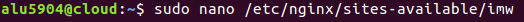

Ahora añadimos el contenido a imw.

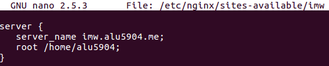

A continuación tenemos que enlazar el fichero que hemos creado para que esté disponible desde los sites-enabled. Para ello entramos a /etc/nginx/sites-enabled, hacemos un enlace simbólico y lo comprobamos.

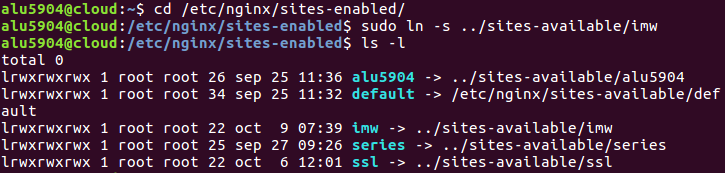

Por último, tenemos que recargar la configuración de Nginx para que los cambios surtan efecto, para ello utilizamos el comando systemctl reload nginx.

Ahora tenemos que ir a la moodle de IMW y descargarnos la imagen del Diagrama de unidades de trabajo.

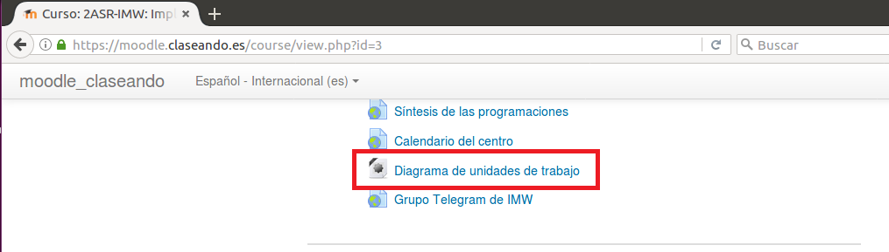

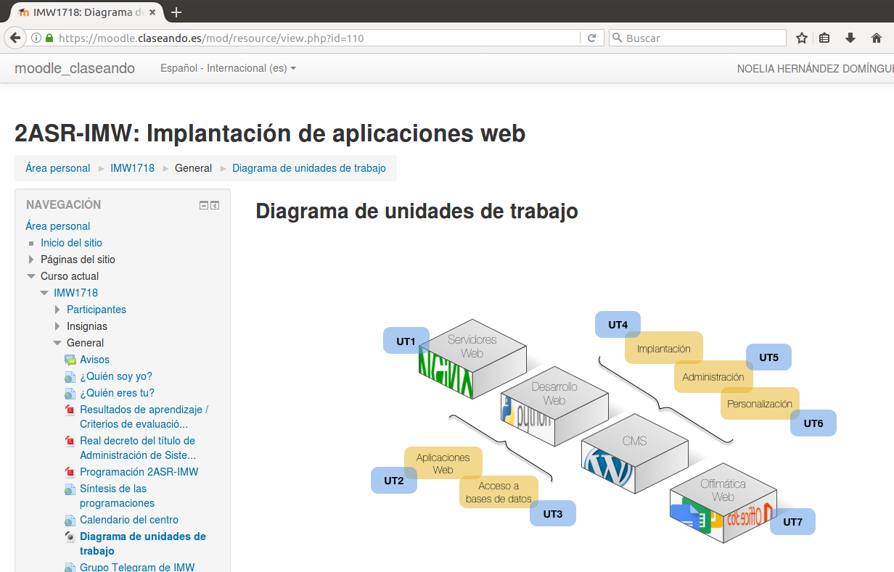

Ahora la imagen que hemos descargado en la máquina de desarrollo la copiamos a la máquina de producción.

Comprobamos que tenemos la imagen en la máquina de producción.

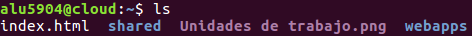

Ahora creamos una carpeta que se llame images, cambiamos el nombre de nuestra imagen y la metemos dentro de la carpeta images.

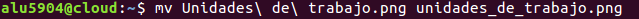

Ahora empezamos a trabajar en el index.html del imw.

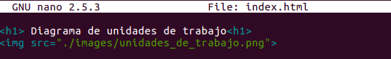

Recargamos la configuración de Nginx para que los cambios surtan efecto.

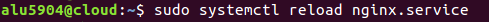

Finalmente entramos desde un navegador a http://imw.alu5904.me.

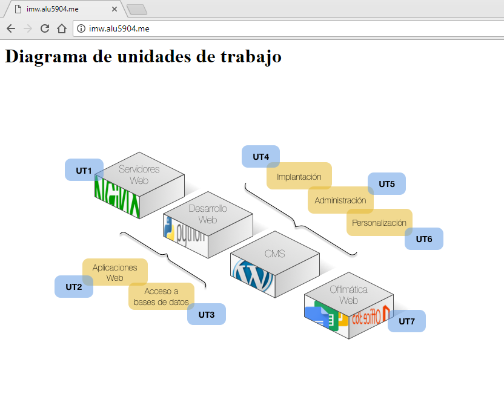

* http://imw.alu5904.me/mec/.

Esta página web debe mostrar una página con un enlace al Real decreto del título de Administración de Sistemas Informáticos en Red - MEC.

Lo primero que hacemos es volver a ir al fichero de configuración de Nginx de imw, es decir, tenemos que ir a la ruta /etc/nginx/sites-available/ y editamos el fichero imw.

Ahora añadimos el location a imw del mec.

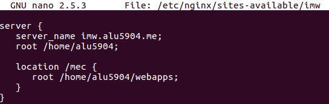

Ahora no tenemos que enlazar el fichero porque ya lo tenemos enlazados anteriormente.

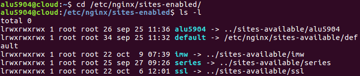

Por último, tenemos que recargar la configuración de Nginx para que los cambios surtan efecto, para ello utilizamos el comando systemctl reload nginx.

Ahora creamos una carpeta dentro de webapps donde estara el index.html de nuestra página web.

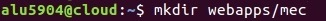

Ahora empezamos a trabajar en el index.html del mec.

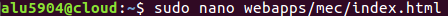

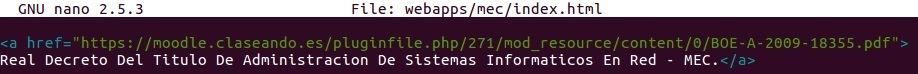

Recargamos la configuración de Nginx para que los cambios surtan efecto.

Finalmente entramos desde un navegador a http://imw.alu5904.me/mec.

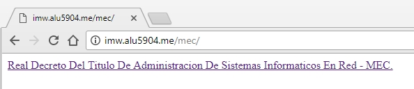

Si pinchamos en el enlace se mostrara lo siguiente.

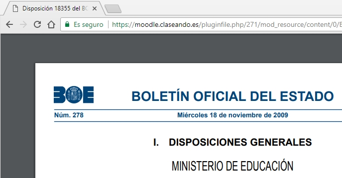

___

# Sitio Web 2.

* http://varlib.alu5904.me:9000.

Esta página web debe mostrar el listado de ficheros y directorios de /var/lib de la máquina de producción.

Lo primero que hacemos es añadir el fichero de configuración de Nginx que tratará las peticiones que se hagan al nombre de dominio varlib.alu5904.me:9000. Para ello vamos a la ruta /etc/nginx/sites-available/ y creamos el fichero varlib.

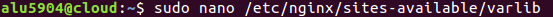

Ahora añadimos el contenido a varlib.

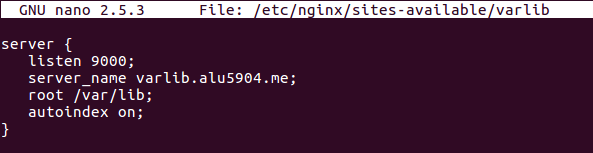

A continuación tenemos que enlazar el fichero que hemos creado para que esté disponible desde los sites-enabled. Para ello entramos a /etc/nginx/sites-enabled, hacemos un enlace simbólico y lo comprobamos.

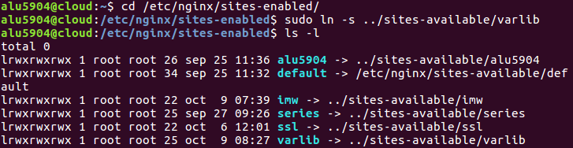

Por último, tenemos que recargar la configuración de Nginx para que los cambios surtan efecto, para ello utilizamos el comando systemctl reload nginx.

Finalmente entramos desde un navegador a http://varlib.alu5904.me:9000.

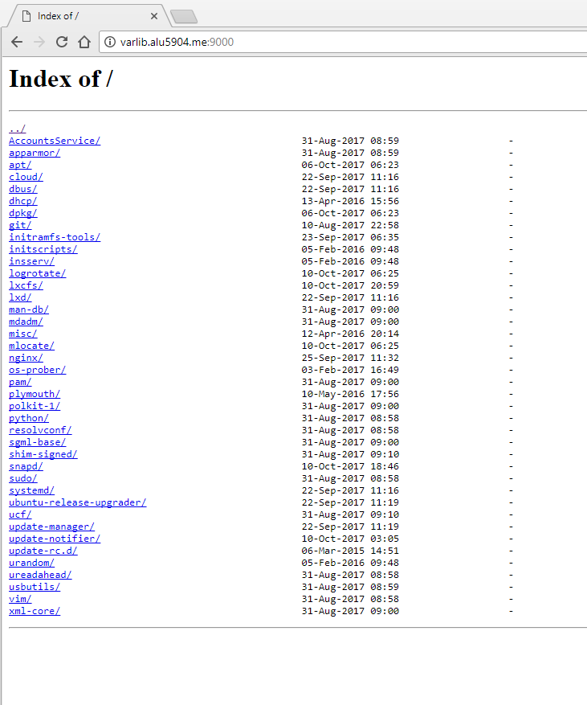

---

# Sitio Web 3.

* https://ssl.alu5904.me/students/.

Esta página web debe mostrar una página web con el nombre de todo el alumnado de clase. Debe pedir usuario/clave. Los datos son: USUARIO: usuario1 y CLAVE: aula108. Debemos prohibir explícitamente el acceso al fichero .htpasswd.

Lo primero que tenemos que hacer es crear una contraseña, para ello utilizamos el comando siguiente, el cual nos cifra la contreña en salt hash.

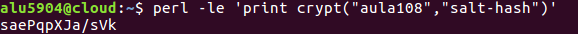

Esta contraseña la introducimos dentro del fichero .htpasswd.

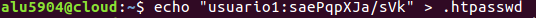

Este fichero tendra prohibido el acceso.

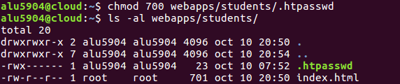

Luego creamos una carpeta dentro de webapps donde estara el index.html y el .htpasswd de nuestra página web.

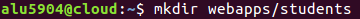

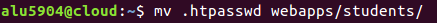

Lo que hacemos ahora es ir al fichero de configuración de Nginx que tratará las peticiones que se hagan al nombre de dominio ssl.alu5904.me/students. Para ello vamos a la ruta /etc/nginx/sites-available/ y editamos el fichero ssl.

Ahora añadimos el contenido a ssl.

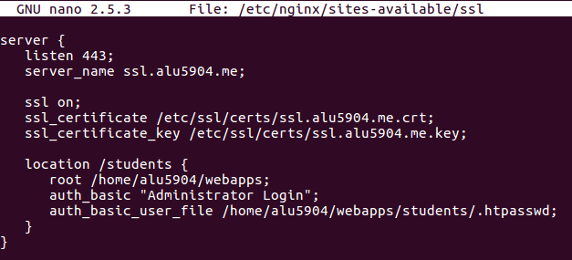

Ahora no tenemos que enlazar el fichero porque ya lo tenemos enlazados anteriormente.

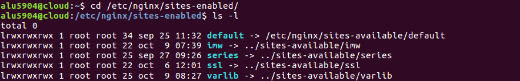

Por último, tenemos que recargar la configuración de Nginx para que los cambios surtan efecto, para ello utilizamos el comando systemctl reload nginx.

Ahora empezamos a trabajar en el index.html del students.

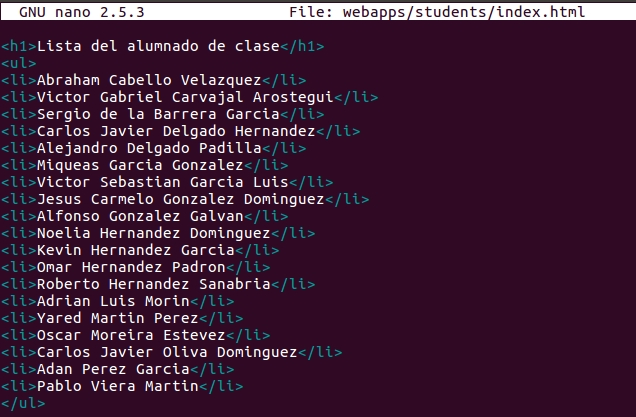

Recargamos la configuración de Nginx para que los cambios surtan efecto.

Finalmente entramos desde un navegador a http://ssl.alu5904.me/students/.

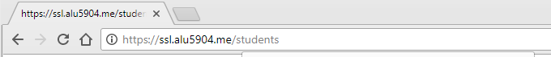

Nos pide un usuario y una contraseña, si la ponemos correcta nos ocurrira lo siguiente.

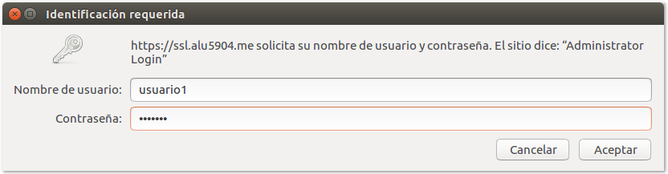

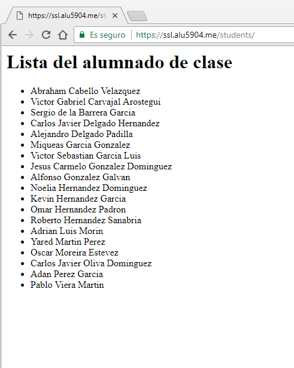

En el caso de poner mal la contraseña nos ocurrira lo siguiente.

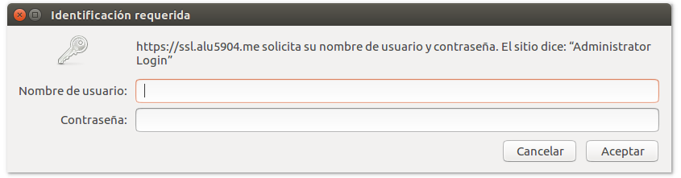

Nos repetira siempre la identificación hasta que pongamos la correcta.

___

# Sitio Web 4.

* http://redirect.alu5904.me.

Esta página web se debe redirigir cualquier petición de este dominio a http://target.alu5904.me.

Lo primero que hacemos es añadir el fichero de configuración de Nginx que tratará las peticiones que se hagan al nombre de dominio imw.alu5904.me. Para ello vamos a la ruta /etc/nginx/sites-available/ y creamos el fichero target.

Ahora tenemos que ir a la moodle de IMW y descargarnos la imagen del Diagrama de unidades de trabajo.

Ahora el archivo .zip que hemos descargado en la máquina de desarrollo la copiamos a la máquina de producción.

Comprobamos que tenemos el archivo .zip en la máquina de producción y lo descomprimimos.

Ahora añadimos el contenido a imw.

A continuación tenemos que enlazar el fichero que hemos creado para que esté disponible desde los sites-enabled. Para ello entramos a /etc/nginx/sites-enabled, hacemos un enlace simbólico y lo comprobamos.

Por último, tenemos que recargar la configuración de Nginx para que los cambios surtan efecto, para ello utilizamos el comando systemctl reload nginx.

Ahora empezamos a trabajar en el index.html del redirect.

Recargamos la configuración de Nginx para que los cambios surtan efecto.

Finalmente entramos desde un navegador a http://redirect.alu5904.me, http://www.redirect.alu5904.me/probando y http://www.redirect.alu5904.me/hola.

* http://target.alu5904.me.

Al acceder a esta página web se debe mostrar la página web siguiente initializr-verekia-4.0.zip.

Para copiar y descomprimir el fichero initializr.zip se recomienda usar alguna de las siguientes herramientas: curl, wget, scp, unzip.

Los logfiles deben ser: /var/log/nginx/redirect/access.log y /var/log/nginx/redirect/error.log.

---
