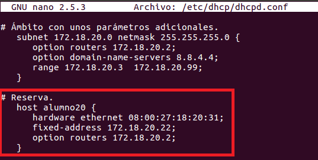
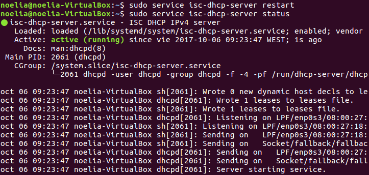

___

# **Instalación Y Configuración DHCP Linux.**

___

# **1. Introducción.**

Vamos a crear un manual de instalación y configuración de un servidor DHCP en una máquina con Linux, en esta instalación utilizaremos Ubuntu (Server). También utilizaremos otra máquina con Linux, otro Ubuntu (Cliente), para hacer que utilice el servidor DHCP.

Durante esta instalación y configuración hay que tener en cuenta que el servidor no debe estar abierto a la red, es decir, hay que configurar el adaptador en red interna para no provocar conflictos de direcciones.

---

# **2. Instalación Del Servicio DHCP En Linux.**

Instalamos el servicio DHCP en Ubuntu.

---

# **3. Configuración Del Servicio DHCP.**

Configuramos el servicio DHCP, para ello tenemos que modificar el archivo /etc/dhcp/dhcpd.conf.

Dentro de este archivo creamos un ámbito nuevo para el servicio DHCP. Ponemos una subred con su dirección y su máscara, las cuales he considerado convenientes. Configuramos la puerta de enlace y los servidores DNS a suministrar a los clientes. También configuramos un rango de direcciones IP para suministrar a los clientes.

Ahora tenemos que iniciar el servicio DHCP y ver su estado.

___

# **4. Comprobar Funcionamiento DHCP.**

Comprobamos el funcionamiento DHCP configurando adecuadamente la máquina Cliente. Para ello ponemos la máquina Cliente en DHCP y en la consola ponemos el comando ifconfig.

---

# **5. Reserva.**

Creamos una reserva de una dirección asociada a un equipo específico (MAC). Para poder hacer esto lo creamos dentro de donde tenemos el ámbito.

Dentro de este archivo creamos una reserva para nuestro cliente. Para ello ponemos la dirección MAC de mi cliente, una dirección IP que considero conveniente para este equipo y configuramos la puerta de enlace.

Ahora tenemos que reiniciar el servicio DHCP y ver su estado.

___

# **6. Comprobar Funcionamiento DHCP.**

Comprobamos el funcionamiento DHCP configurando adecuadamente la máquina Cliente. Para ello en la consola ponemos el comando ifconfig.

___

# **6. Otras Opciones.**

Ahora ponemos otras opciones al ámbito. Para poder hacer esto lo creamos dentro de donde tenemos el ámbito.

Configuramos algunas opciones de servidor además de las habituales, por ejemplo, el tiempo por defecto que tendrán las direcciones IP asignadas a los clientes.

Ahora tenemos que reiniciar el servicio DHCP y ver su estado.

___

# **7. Comprobar Funcionamiento DHCP.**

Comprobamos el funcionamiento DHCP configurando adecuadamente la máquina Cliente. Para ello en la consola ponemos el comando ifconfig

---
