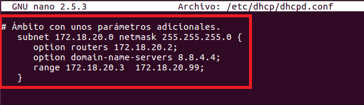

___

# **Instalación Y Configuración DHCP Linux.**

___

# **1. Introducción.**

Vamos a crear un manual de instalación y configuración de un servidor DHCP en una máquina con Linux, en esta instalación en Ubuntu. También utilizaremos otra máquina con Linux, otro Ubuntu, para hacer que utilice el servidor DHCP.

Durante esta instalación y configuración hay que tener en cuenta que el servidor no debe estar abierto a la red, es decir, hay que configurar el adaptador en red interna para no provocar conflictos de direcciones.

---

# **2. Instalación Del Servicio DHCP En Linux.**

Instalamos el servicio DHCP en Ubuntu Linux.

---

# **3. Configuración Del Servicio DHCP.**

Configuramos el servicio DHCP para ello tenemos que modificar el archivo /etc/dhcp/dhcpd.conf.

Dentro de este archivo creamos una ámbito para el servicio DHCP. Para ello ponemos unas direcciones IP que considero convenientes. Configuro la puerta de enlace, los servidores DNS a suministrar a los clientes. También configuramos un rango de direcciones IP para suministrar a los clientes.

Ahora tenemos que iniciar el servicio DHCP y ver su estado.

___

# **4. Comprobar Funcionamiento DHCP.**

Comprobamos el funcionamiento DHCP configurando adecuadamente la máquina Cliente. Para ello ponemos la máquina Cliente en DHCP y ponemos el comando ifconfig.

---

# **5. Reserva.**

Luego creamos una reserva de dirección asociada a un equipo específico (MAC). Para ello lo creamos dentro de donde tenemos el ámbito.

Dentro de este archivo creamos una reserva para nuestro cliente. Para ello ponemos la dirección MAC de mi cliente, una dirección IP que considero conveniente y configuro la puerta de enlace.

Ahora tenemos que reiniciar el servicio DHCP y ver su estado.

___

# **6. Comprobar Funcionamiento DHCP.**

Comprobamos el funcionamiento DHCP configurando adecuadamente la máquina Cliente. Para ello ponemos el comando ifconfig.

___

# **6. Otras Opciones.**

Configuramos algunas opciones de servidor además de las habituales. Por ejemplo, el tiempo por defecto que tendran las direcciones IP y el máximo tiempo que tendra las direcciones IP.

___

# **7. Comprobar Funcionamiento DHCP.**

Comprobamos el funcionamiento DHCP configurando adecuadamente la máquina Cliente. Para ello ponemos el comando ifconfig.

---
