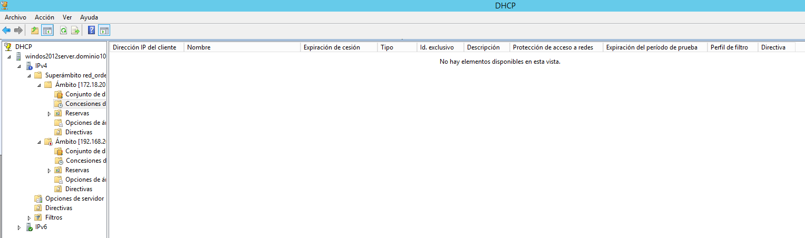
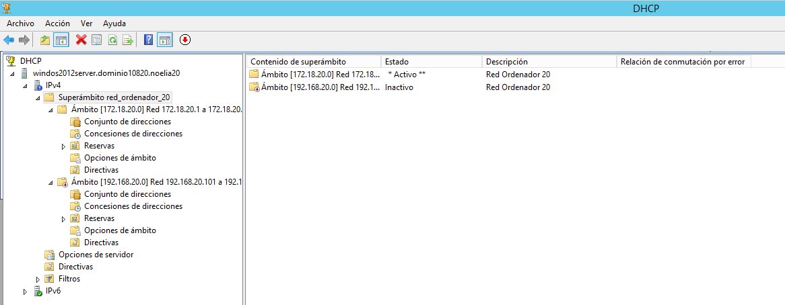

___

# **Instalación Y Configuración DHCP Windows.**
___

# **1. Introducción.**

Vamos a crear un manual de instalación y configuración de un servidor DHCP en una máquina con Windows 2012 Server. También utilizaremos una máquina con Windows 10 para hacer que utilice el servidor DHCP.

Durante esta instalación y configuración hay que tener en cuenta que el servidor no debe estar abierto a la red, es decir, hay que configurar el adaptador en red interna para no provocar conflictos de direcciones.

---

# **2. Instalación Del Servicio DHCP En Windows 2012 Server.**

Lo primer que tenemos que hacer es ir a Administrador del Servidor.

Luego tenemos que ir a Administrar y vamos a agregar roles y características.

El resto de pasos los realizamos como se pueden ver en las imágenes.

Ahora pinchamos en completar configuración de DHCP.

Finalmente terminamos la instalación del Servicio DHCP.

# **3. Configuración Del Servicio DHCP Del Primer Ámbito.**

Ahora debo ir a herramientas y luego a DHCP para poder crear un ámbito nuevo asociado a un dominio con un intervalo de direcciones que considero conveniente.

Ahora dentro de aquí creo el ámbito.

Agrego el nombre que le quiero dar al ámbito y también una pequeña descripción.

Añado una dirección IP con máscara de clase B.

No agrego ninguna exclusión, ya que en el intervalo de direcciones IP no añadí las que necesito para otras cosas del ámbito.

Configuramos la puerta de enlace con una de las direcciones que deje fuera del intervalo de direcciones IP.

También configuro los servidores DNS.

Finalmente hemos creado nuestro ámbito con las configuraciones que hemos considerado convenientes.

# **4. Comprobar Funcionamiento DHCP Del Primer Ámbito.**

Para comprobar que funciona el DHCP tenemos que ir a nuestra máquina virtual de Windows 10 y poner su dirección IP automática, esto lo hago para que coja señal de mi servidor DHCP.

# **5. Configuración Del Servicio DHCP Del Segundo Ámbito.**

Denuevo creamos otro nuevo ámbito con otros parámetros que considere oprtunos y que puedan estar ambos ámbitos a la vez.

Ahora dentro de aquí creo el nuevo ámbito.

Agrego el nombre que le quiero dar al ámbito y también una pequeña descripción.

Añado una dirección IP con máscara de clase C.

No agrego ninguna exclusión, ya que en el intervalo de direcciones IP no añadí las que necesito para otras cosas del ámbito.

Configuramos la puerta de enlace con una de las direcciones que deje fuera del intervalo de direcciones IP.

También configuro los servidores DNS.

Finalmente hemos creado nuestro ámbito con las configuraciones que hemos considerado oportunas.

# **6. Comprobar Funcionamiento DHCP Del Segundo Ámbito.**

Ahora tenemos que inactivar el ámbito dominio y poner activo el segundo ámbito.

Para comprobar que funciona el DHCP tenemos que ir a nuestra máquina virtual de Windows 10, poner su dirección IP automática, esto lo hago para que coja señal de mi servidor DHCP.

# **7. Superámbito DHCP.**

Ahora creo un superámbito DHCP que incluya a los dos ámbitos anteriores.

El resto de pasos los realizamos como se pueden ver en las imágenes.

Finalmente el superámbito esta creado.

Tenemos que borrar una dirección IP de cliente que se guarda durante el tiempo que le marque en la configuración.

Vamos desactivando cada ámbito y así vemos que se conecta al otro ámbito.

