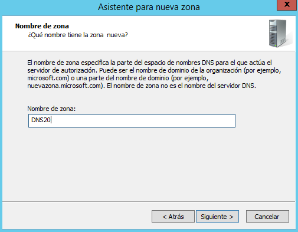
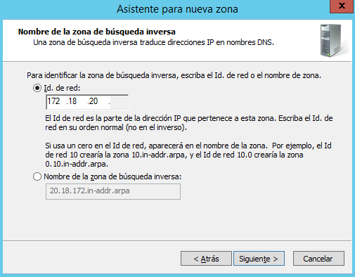
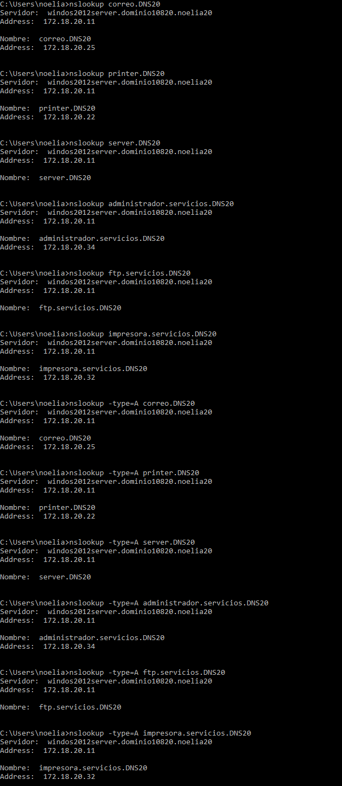
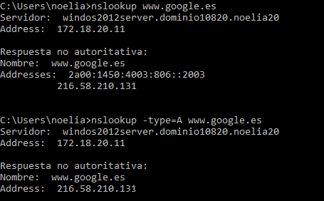

___

# **Instalación Y Configuración DNS Windows.**

Realizamos la Instalación y Configuración de un Servidor DNS en una máquina con Windows Server 2012.

Al haber instalado anteriormente el Active Directory ya tenemos instalado el DNS.

---

# **1. Zona Directa.**

En este apartado tenemos que crear una nueva zona de búsqueda directa en el Servidor.

Creamos una zona de búsqueda directa.

Nos sale el asistente para la nueva zona.

Elegimos el tipo de zona que queremos.

Seleccionamos que queremos que se repliquen los datos para todos los servidores DNS que se ejecutan en controladores de dominio en el dominio que tengo.

Le ponemos un nombre a nuestra zona.

Permitimos actualizaciones dinámicas seguras.

Se ha creado la nueva zona.

Ya contamos con otra zona de búsqueda directa.

---

# **2. Zona Inversa.**

En este apartado tenemos que crear una nueva zona de búsqueda inversa para la subred.

Nos sale el asistente para la nueva zona.

Elegimos el tipo de zona que queremos.

Seleccionamos que queremos que se repliquen los datos para todos los servidores DNS que se ejecutan en controladores de dominio en el dominio que tengo.

Elegimos la zona de búsqueda inversa para IPv4.

Identificamos la zona de búsqueda inversa escribiendo la Id. de red.

Permitimos actualizaciones dinámicas seguras.

Se ha creado la nueva zona.

Ya contamos con una zona de búsqueda inversa.

---

# **3. Reenviadores.**

Configuramos reenviadores de DNS con un DNS público, por ejemplo 8.8.4.4.

---

# **4. Servidor DNS Caché.**

Configuramos el Servidor para ser Servidor DNS Caché, esto se hace en la configuración estática de red.

Configuramos el Cliente para que su Servidor DNS sea el Servidor Windows 2012.

Comprobamos el funcionamiento como caché DNS de ambas máquinas al acceder a sitios de Internet.

* Desde el Servidor.

* Desde el Cliente.

---

# **5. Servidor DNS Maestro.**

Ahora tenemos que configurar el servidor como DNS Maestro, además de Caché.

En la zona de búsqueda directa añadimos los siguientes registros.

* Un alias para el servidor denominado server.        

* Una impresora con IP fija denominada printer.

* Un servidor de correo denominado correo, asociado a una dirección en mi servidor.

Ya tenemos estos tres registros creados.

Creamos una subzona denominada servicios, un dominio nuevo.

Ahora tenemos que añadir otros registros dentro de la subzona.

Dentro de la subzona demoninada servicios añadimos los siguientes registros.

* Agregamos un servidor ftp.

* Una impresora nueva.

* El Equipo del administrador del sistema.

Finalmente ya tenemos estos tres registros creados.

---

# **6. Comprobaciones.**

Comprobamos que se resuelven los nombres desde la consola del Servidor.

Validamos un cliente en el dominio y comprobamos que el nombre de su equipo aparece en la zona de búsqueda del servidor como un nuevo registro A.

Comprobamos desde la consola del cliente que se resuelven correctamente los nombres dados de alta en el servidor.

Realizamos también desde el cliente, algunas operaciones con nslookup tanto dentro como fuera de nuestra intranet.

* Dentro de nuestra intranet.

* Fuera de nuestra intranet.

---
