___

>Trabajo Realizado Por:
>
>* Carlos Javier Delgado Hernández.
>
>* Noelia Hernández Domínguez.

---

# **Instalación Y Configuración DNS Linux.**

Realizamos la Instalación y Configuración de un Servidor DNS Bind9 en una máquina Linux.

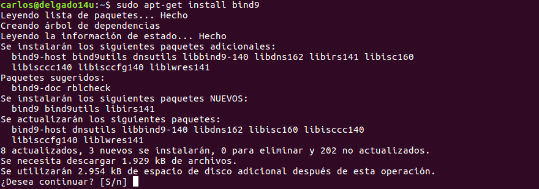

`Sudo apt-get install bind9`

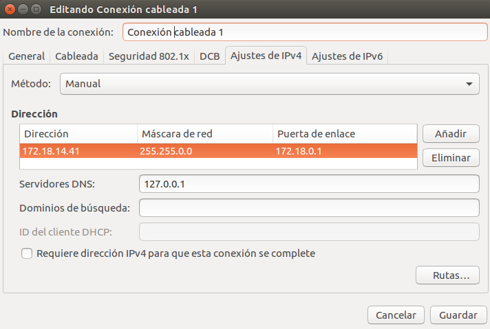

`Configuración de red de la máquina Servidor DNS Ubuntu.`

Se piden las siguientes acciones de Configuración y Prueba del funcionamiento del Servicio.

# **1. Servidor DNS.**

Indicamos a Linux que el Servidor DNS es él mismo, para ello vamos a `/etc/resolv.conf`, lo editamos y ponemos el 127.0.0.1.

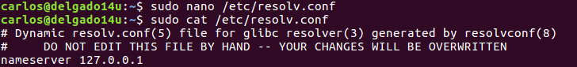

Posteriormente, editamos el archivo localizado en `/etc/resolvconf/resolv.conf.d/base` y asignamos la linea de texto siguiente.

Con esta configuración conseguimos que el Servidor DNS redireccione hacía si mismo.

---

# **2. Servidor Como Caché DNS.**

Configuramos el Servidor como caché DNS, para ello añadimos en  `/etc/bind/named.conf.options` los reenviadores de DNS con DNS públicos, en nuestro caso añadimos la 8.8.8.8.

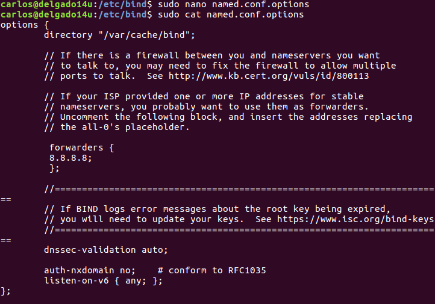

Reiniciamos el Servicio para recargar la nueva configuración establecida.

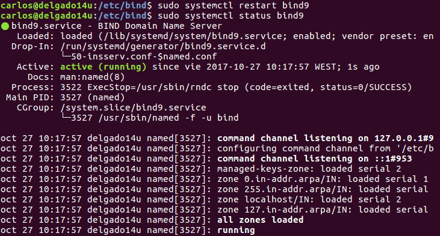

`Sudo systemctl restart/status bind9.`

# **3. Comprobaciones.**

Comprobamos la resolución de nombres externos, tanto desde el Servidor como desde un Cliente al que le preste servicio DNS.

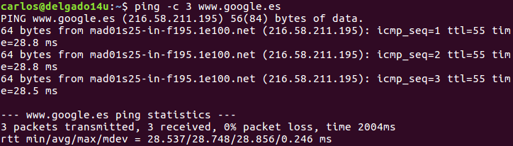

`Ping desde la máquina Servidor.`

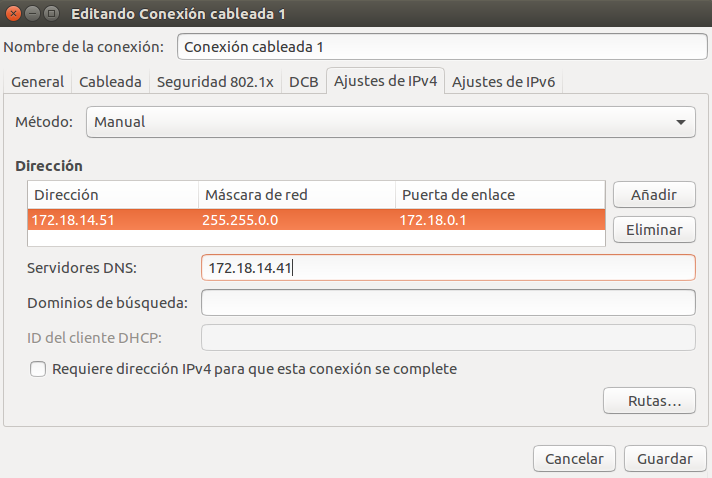

`Configuración de red del Cliente Ubuntu.`

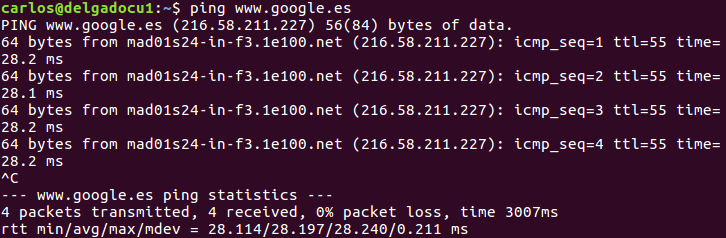

`Ping desde la máquina Cliente Ubuntu.`

___

# **4. Servidor Como Maestro DNS.**

Configuramos como DNS Maestro instalando un dominio ficticio, por ejemplo una empresa virtual y añadimos una configuración para búsquedas de zona directa y zona inversa en `/etc/bind/named.conf.local`.

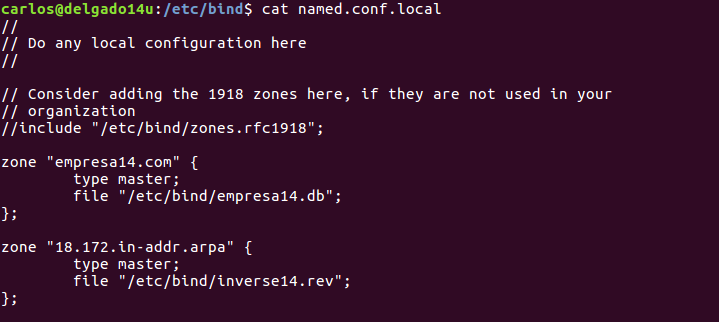

`Establecemos los archivos de configuración "empresa14.db" para la ZBD  y "inverse14.rev" para la ZBI.`

Creamos un archivo de búsqueda directa y otro de búsqueda inversa con los registros que consideramos oportunos. Utilizamos la configuración básica incluida en los archivos db.local (directa) y db.127 (inversa).

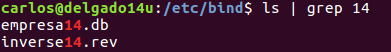

La configuración establecida dentro del archivo "empresa14.db" es.

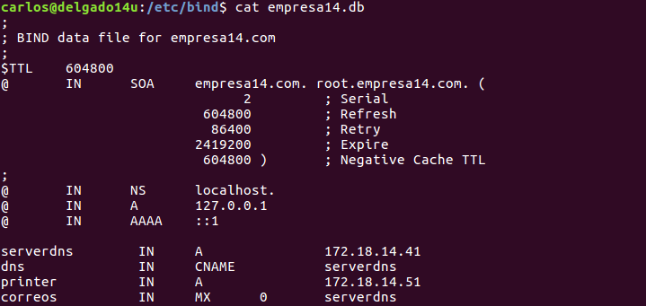

La configuración establecida dentro del archivo "inverse14.rev" es.

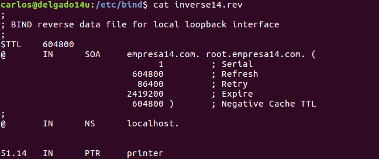

Reiniciamos el servicio para establecer la nueva configuración

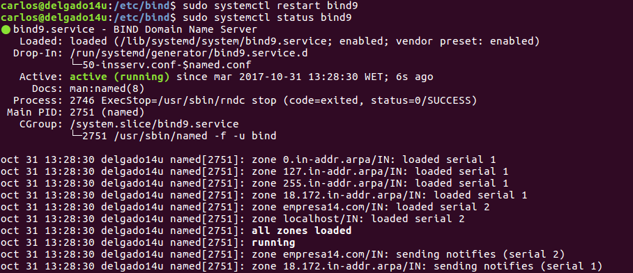

---

# **5. Comprobaciones.**

Comprobamos con el comando nslookup/host que se resuelven los nombres desde la consola del Servidor.

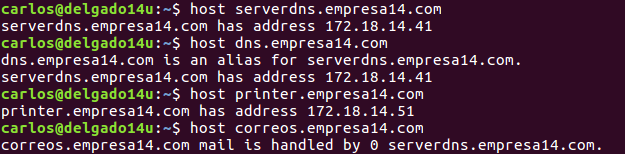

Comprobamos desde la consola del Cliente que se resuelven correctamente los nombres dados de alta en el Servidor.

---

# **6. Servidor Esclavo.**

Clonamos la máquina con el Servidor bind9 instalado y configuramos el nuevo linux para que bind9 se comporte como un Servidor Esclavo.

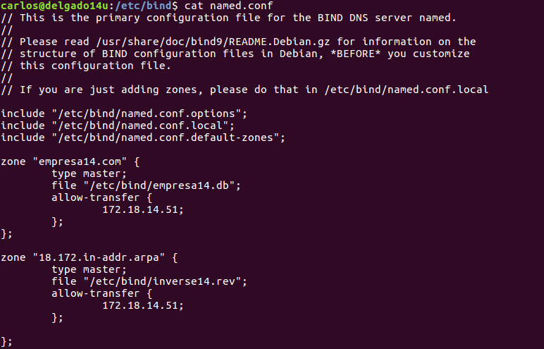

Archivo de Configuración "named.conf" del Servidor DNS Ubuntu.

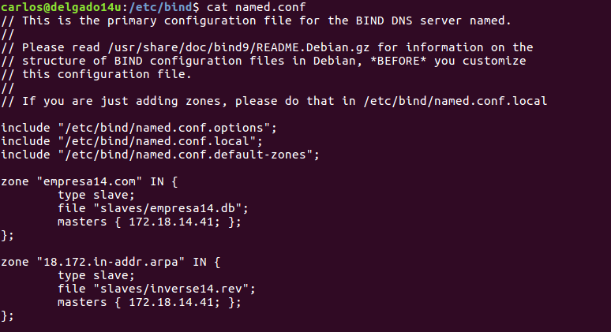

Archivo de Configuración "named.conf" del Servidor Secundario DNS Ubuntu.

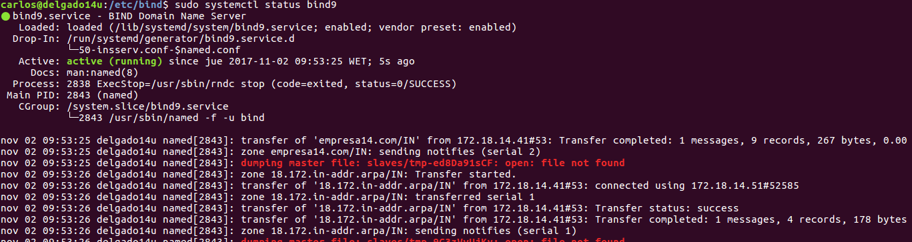

`Estado del Servicio en el Servidor Secundario.`

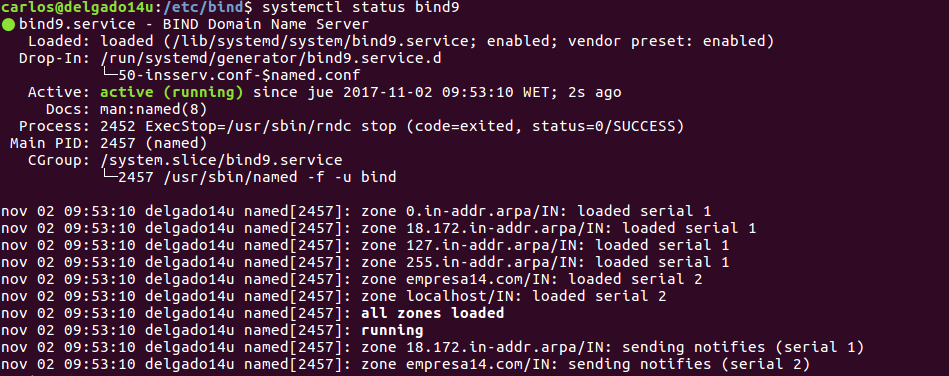

`Estado del Servicio en el Servidor DNS Primario.`

---
