___

>Trabajo Realizado Por:
>
>* Noelia Hernández Domínguez.
>
>* Omar Hernández Padrón.

---

# **Práctica Servidor Web Apache - Linux.**

---

## **Apache.**

Instalamos Apache con el comando sudo apt-get install apache2.

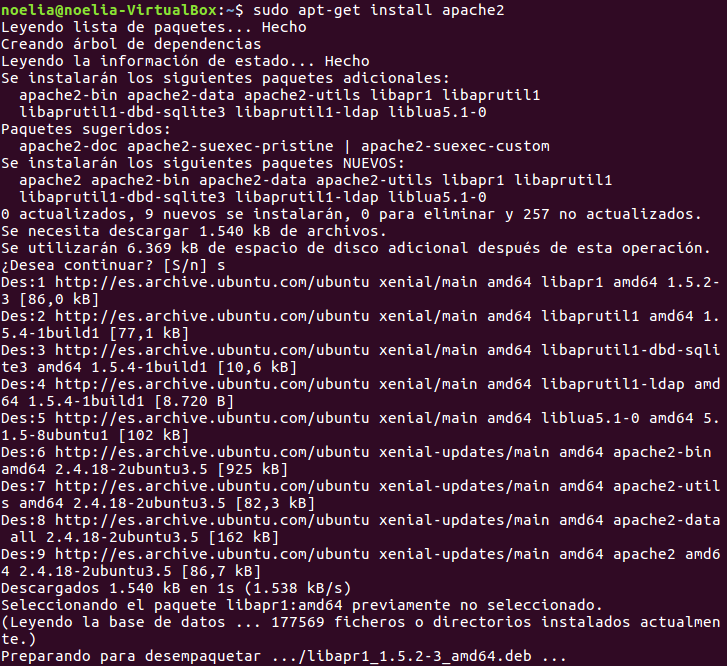

Comprobamos en la carpeta raíz el sitio web /var/www.

Comprobamos el acceso a localhost.

Añadimos la línea `www.miempresa.com` asociada a la IP del Servidor, que es 172.18.20.41, en `/etc/hosts`.

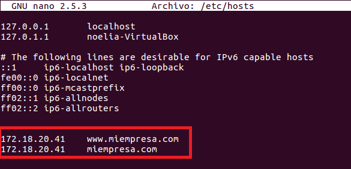

Comprobamos el acceso a `www.miempresa.com`.

Reiniciamos apache con el comando sudo /etc/init.d/apache2 restart.

Comrpobamos que dentro de `/var/log/apache2/` se encuentran error.log y access.log.

---

## **PHP.**

Instalamos php con el comando sudo apt-get install php.

Tenemos que comprobar el acceso a index.php, el cual tiene el siguiente contenido.

~~~
<?php phpinfo(); ?>
~~~

Utilizamos el comando sudo apt-get install libapache2-mod-php para instalar unos modulos de php.

Vamos al navegador y comprobamos el acceso a localhost y a `www.miempresa.com`.

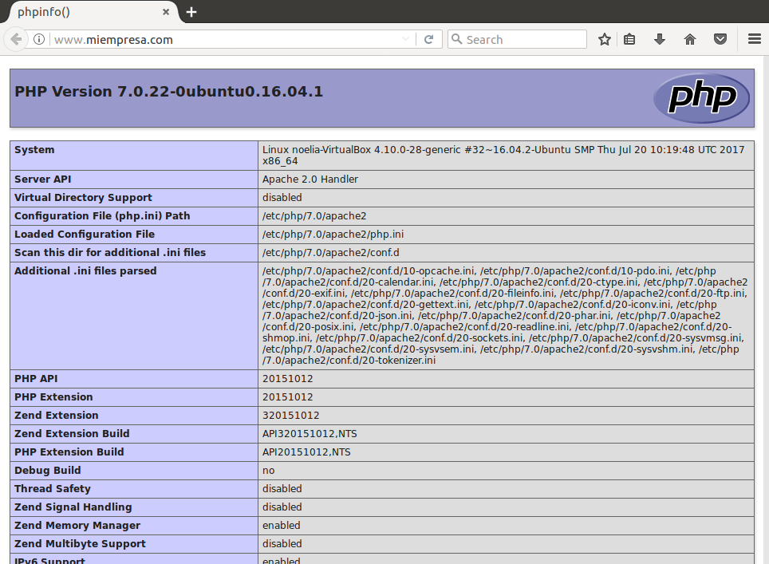

Creamos Hosts Virtuales en Apache, es decir, asociamos carpetas con sitios web, empleados.miempresa.com a /var/www/empleados, y establecemos la configuración en /etc/apache2/sites-available/000-default.conf.

Lo primero es hacer la carpeta en `/var/www`.

Ahora tenemos que ir a `/etc/apache2/sites-available/000-default.conf`

No hace falta crear un enlace simbólico en `/etc/apache2/sites-enabled` ya que esta creado.

---

## **Configurar Sitio Web Seguro Pagos.**

Al instalar Apache, se instala también SSL.

Generamos certificado autofirmado:

* openssl genrsa -des3 -out server.key 1024
* openssl rsa -in server.key -out server.pem
* openssl req -new -key server.key -out server.csr
* openssl x509 -req -days 360 -in server.csr -signkey server.key -out server.crt

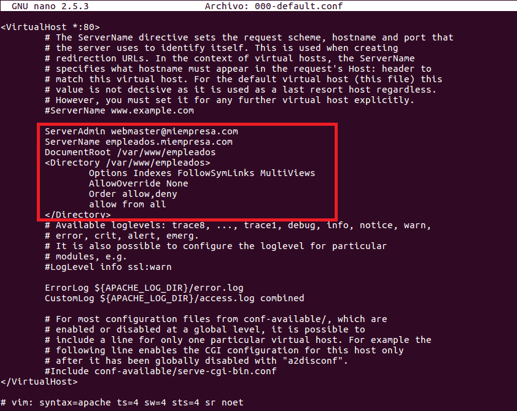

Creamos un nuevo virtual host a partir del /etc/apache2/sites-available/000-default.conf según indicaciones PDF para crear host virtual seguro

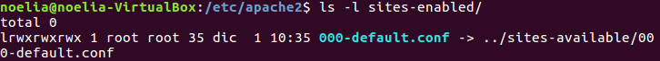

Hacemos un enlace simbólico en `/etc/apache2/sites-enabled`

Habilitamos el módulo SSL apache con el comando sudo a2enmod ssl.

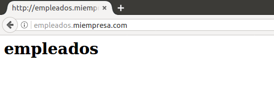

Añadimos a /etc/hosts pagos.miempresa.com.

Hacemos la carpeta pagos donde estará un index.html.

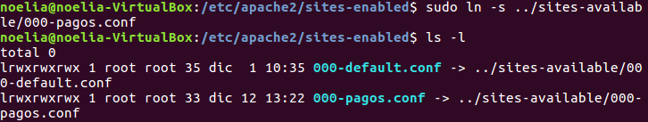

---

## **Acceso A Carpetas Privadas.**

Autenticación mediante .htaccess.

Estructura: empleados.miempresa.com (acceso a todos los empleados pero no anónimos) y subcarpetas personales de empleados (dos o tres, con acceso limitado al usuario)

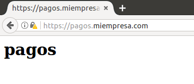

---

## **MySQL.**

Instalar MySQL: sudo apt-get install mysql-server.

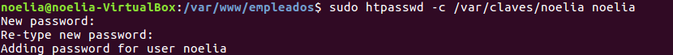

Instalar soporte php para MySQL: sudo apt-get install php-mysql.

---

## **phpMyAdmin.**

Descargar última versión (tar.gz) desde phpmyadmin.net, descomprimir en subcarpeta de /var/www (u otra asociada por host virtual) y comprobar acceso.

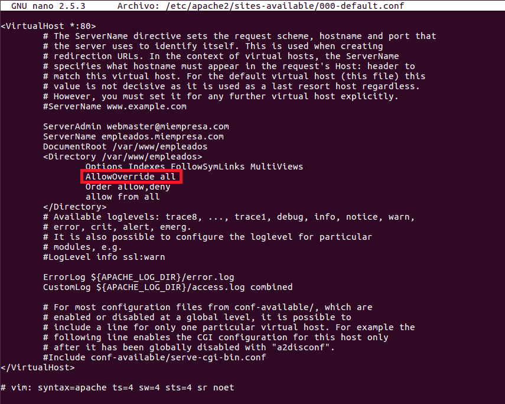

 <- arreglar

 <- arreglar

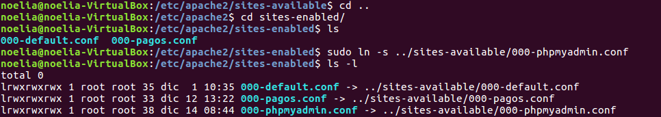

---

## **Plataforma Drupal / Joomla / Moodle / etc.**

Creación bases de datos y usuarios necesarios.

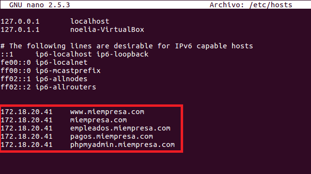

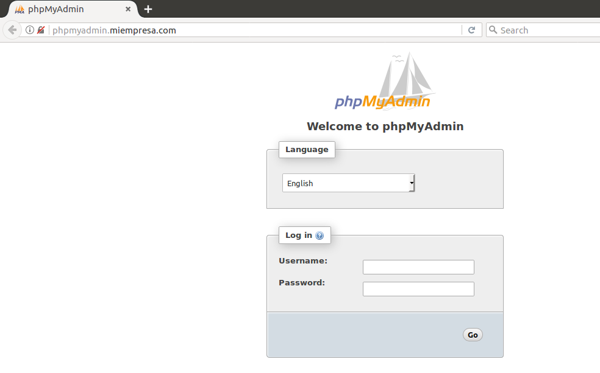

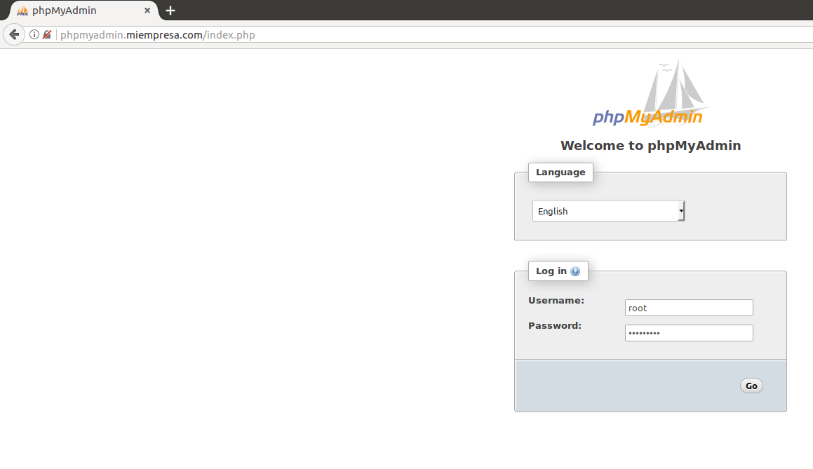

Descargamos, hacemos la instalación y la configuración de la plataforma Drupal en la página principal.

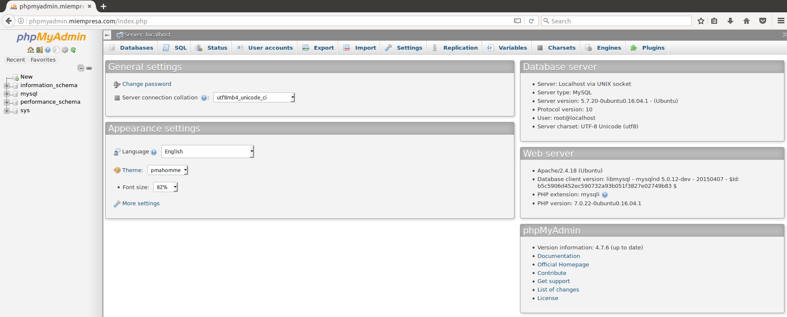

 <- arreglar

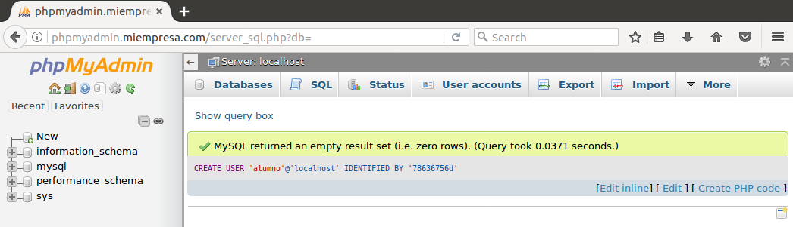 <- arreglar

 <- arreglar

 <- arreglar

 <- arreglar

 <- arreglar

---
