___

>Trabajo Realizado Por:
>
>* Noelia Hernández Domínguez.
>
>* Omar Hernández Padrón.

---

# **Práctica Servidor Web Apache - Linux.**

---

## **Apache.**

Instalamos Apache con el comando sudo apt-get install apache2.

Comprobamos en la carpeta raíz el sitio web `/var/www/`.

Comprobamos el acceso a localhost.

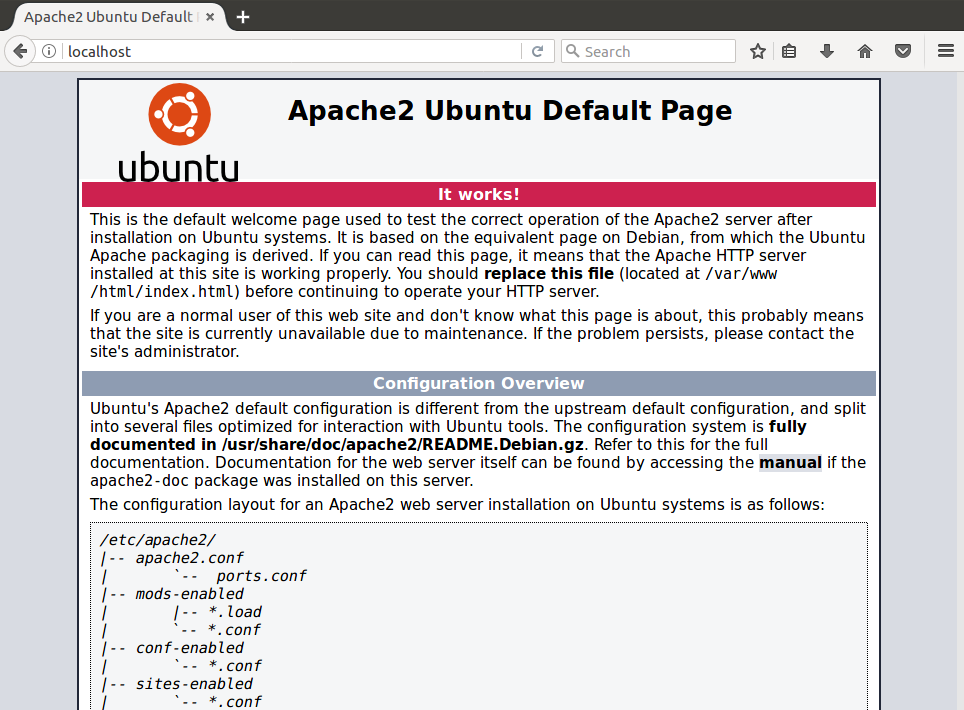

Añadimos la línea `www.miempresa.com` asociada a la IP del Servidor, que es 172.18.20.41, en `/etc/hosts`.

Comprobamos el acceso a `www.miempresa.com`.

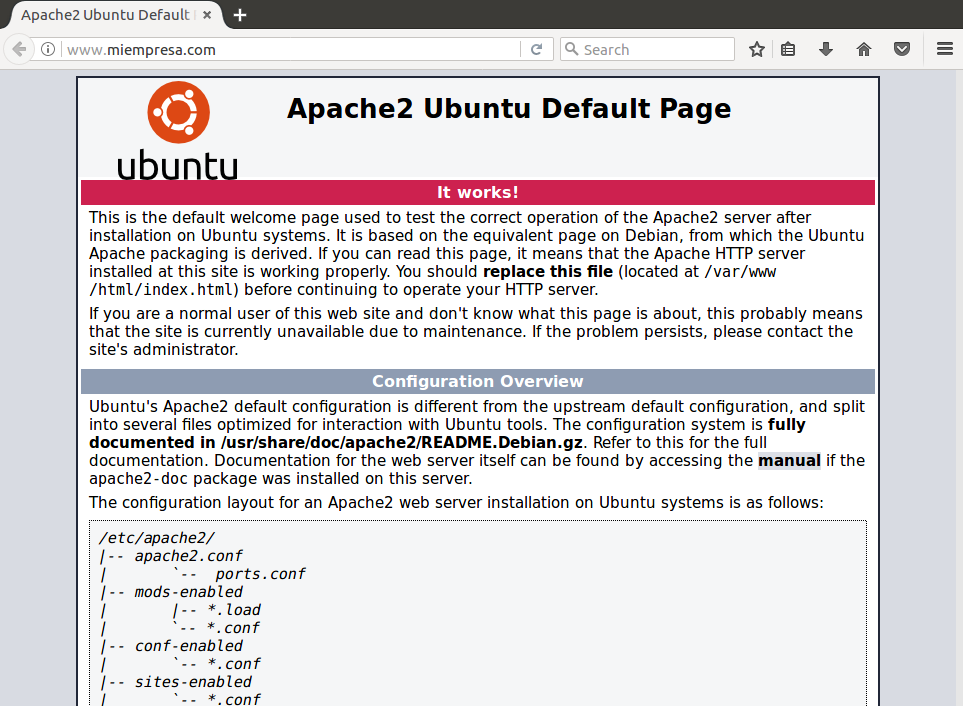

Reiniciamos Apache con el comando sudo /etc/init.d/apache2 restart.

Comprobamos que dentro de `/var/log/apache2/` se encuentran error.log y access.log.

---

## **PHP.**

Instalamos PHP con el comando sudo apt-get install php.

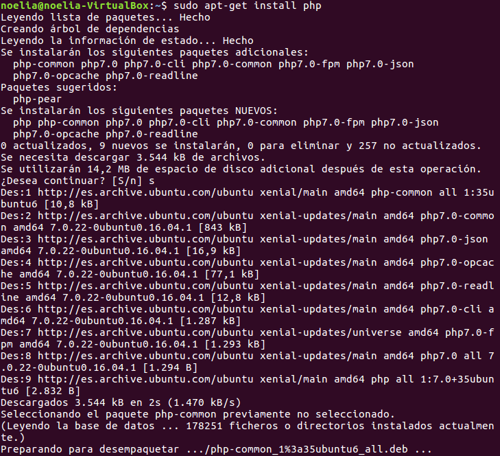

Tenemos que comprobar el acceso a index.php, el cual tiene el siguiente contenido.

~~~
<?php phpinfo(); ?>
~~~

Utilizamos el comando sudo apt-get install libapache2-mod-php para instalar unos modulos de PHP.

Vamos al navegador y comprobamos el acceso a localhost y a `www.miempresa.com`.

---

## **Host Virtuales.**

Creamos Hosts Virtuales en Apache, es decir, asociamos carpetas con sitios web, `empleados.miempresa.com` a `/var/www/empleados`, y establecemos la configuración en `/etc/apache2/sites-available/000-default.conf`.

Lo primero que hacemos es crear la carpeta empleados en `/var/www`.

Dentro de esta carpeta añadimos un index.html.

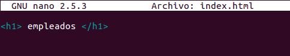

Ahora tenemos que ir a `/etc/apache2/sites-available/` y editamos 000-default.conf.

No hace falta crear un enlace simbólico en `/etc/apache2/sites-enabled` ya que esta creado.

Añadimos la línea `empleados.miempresa.com` en `/etc/hosts`.

Comprobamos el acceso a `empleados.miempresa.com`.

---

## **Configurar Sitio Web Seguro Pagos.**

Al instalar Apache, se instala también SSL.

Generamos un certificado autofirmado, para ello introducimos los siguientes comandos.

* openssl genrsa -des3 -out apache.key 1024.
* openssl rsa -in apache.key -out apache.pem.
* openssl req -new -key apache.key -out apache.csr.
* openssl x509 -req -days 360 -in apache.csr -signkey apache.key -out apache.crt.

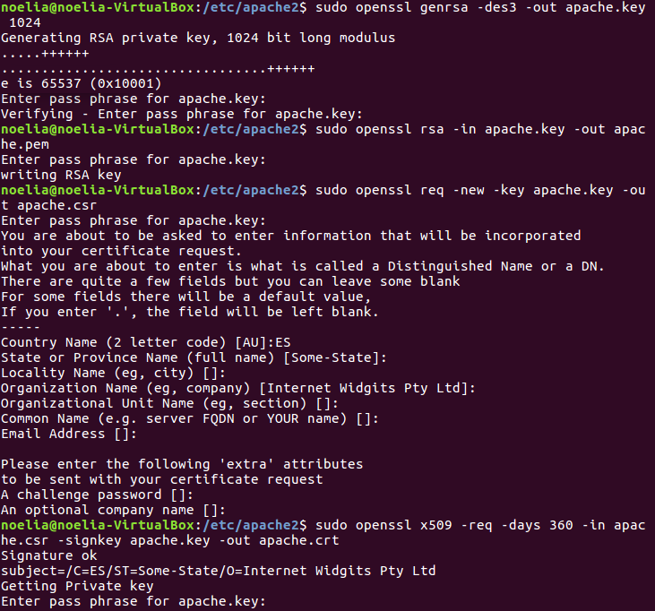

Creamos un nuevo Virtual Host a partir del `/etc/apache2/sites-available/000-default.conf`.

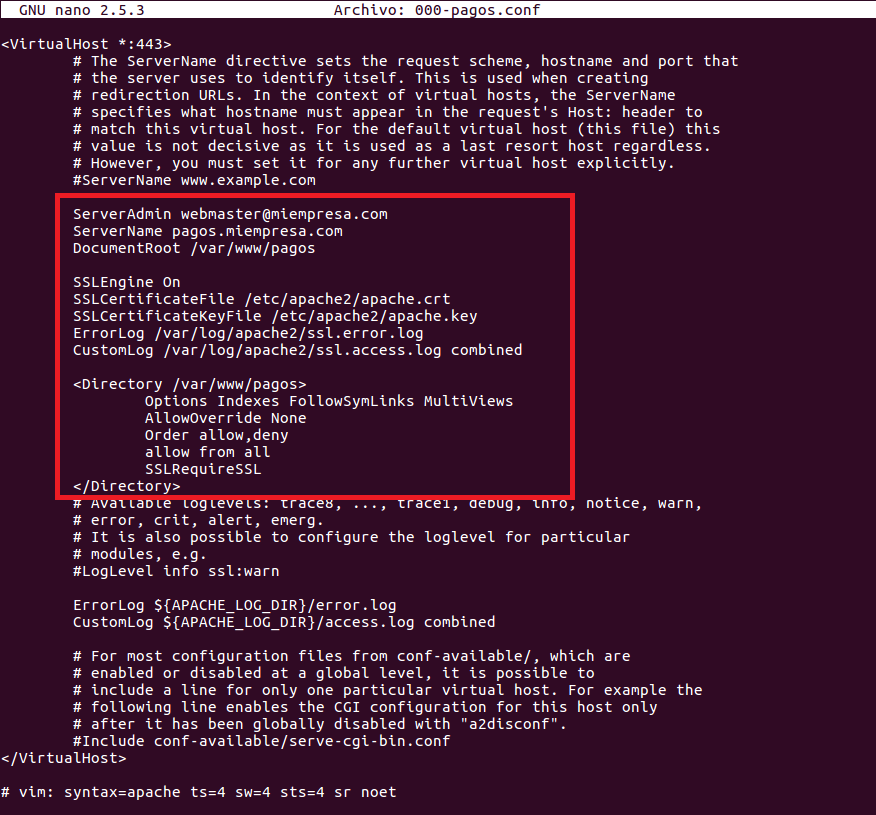

Hacemos un enlace simbólico en `/etc/apache2/sites-enabled`.

Reiniciamos el Servicio de Apache.

Habilitamos el módulo SSL apache con el comando sudo a2enmod ssl.

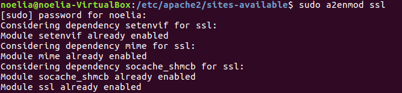

Añadimos a /etc/hosts `pagos.miempresa.com`.

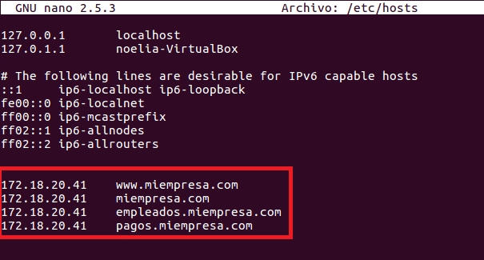

Hacemos la carpeta pagos donde estará un index.html.

Dentro de esta carpeta editamos el index.html.

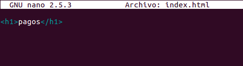

Comprobamos el acceso a `pagos.miempresa.com`.

---

## **Acceso A Carpetas Privadas.**

Autenticación mediante .htaccess, para ello creamos una carpeta de claves, por ejemplo, `/var/claves`.

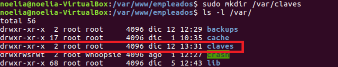

Dentro de la carpeta `/var/www/empleados/` añadimos el .htaccess.

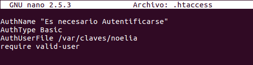

Lanzamos el comando htpasswd -c /var/claves/noelia noelia para

Para hacer que el acceso a `empleados.miempresa.com` sea siempre pidiendo contraseña al usuario tenemos que editar `/etc/apache2/sites-available/000-default.conf`.

Reiniciamos el Servicio de Apache.

Comprobamos el acceso a `empleados.miempresa.com`.

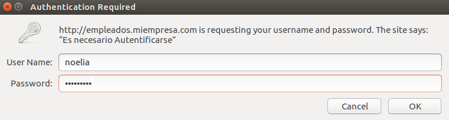

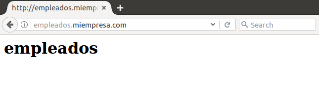

---

## **MySQL.**

Instalamos MySQL con el comando sudo apt-get install mysql-server.

Instalamos el soporte PHP para MySQL con el comando sudo apt-get install php-mysql.

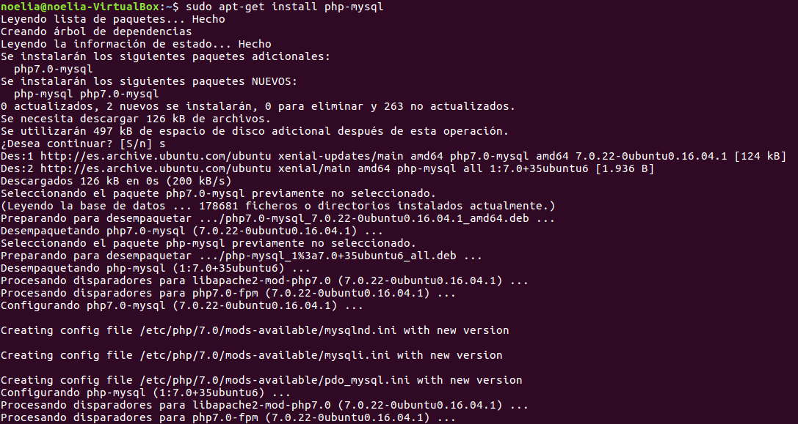

---

## **phpMyAdmin.**

Descargamos la última versión (tar.gz) desde phpmyadmin.net.

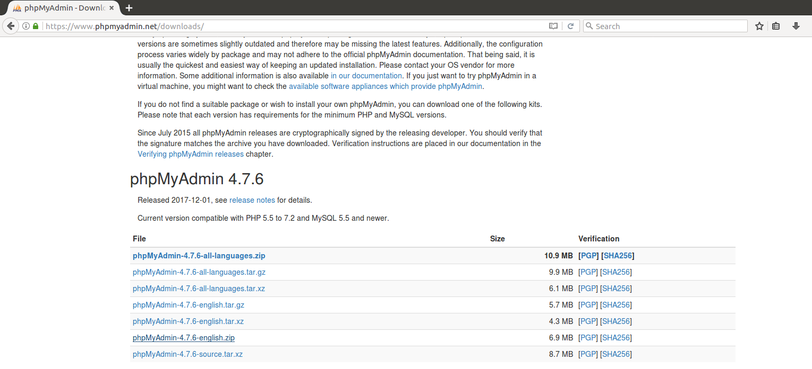

Descomprimimos en la subcarpeta de `/var/www`.

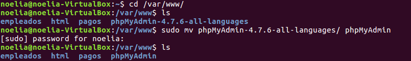

Establecemos la configuración en `/etc/apache2/sites-available`.

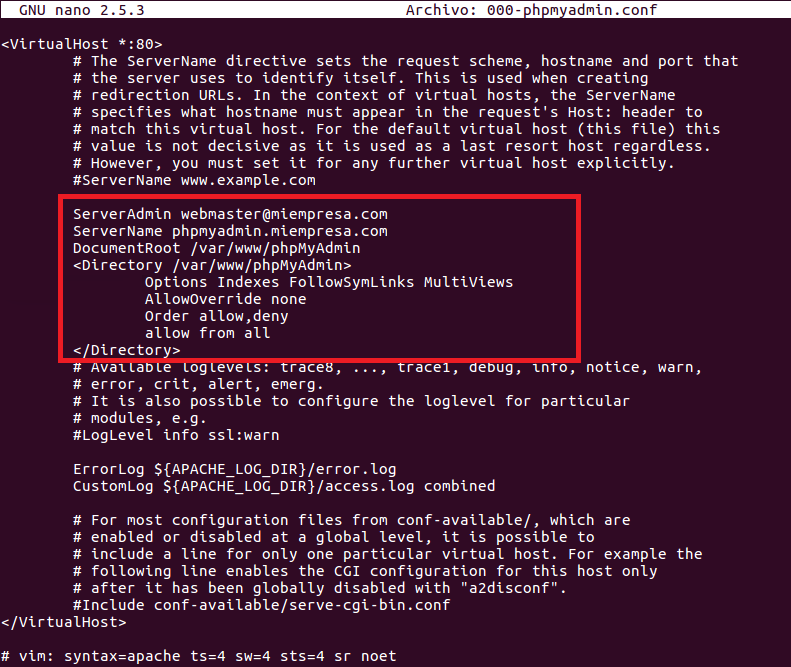

Creamos un enlace simbólico en `/etc/apache2/sites-enabled`.

Habilitamos el módulo SSL apache con el comando sudo a2ensite 000-phpmyadmin.

Añadimos la línea `phpmyadmin.miempresa.com` en /etc/hosts.

Reiniciamos el Servicio de Apache.

Comprobamos el acceso a `phpmyadmin.miempresa.com`.

Introducimos el usuario root con su contraseña.

---

## **Plataforma Drupal.**

Vamos a `phpmyadmin.miempresa.com`, introducimos el usuario root con su contraseña.

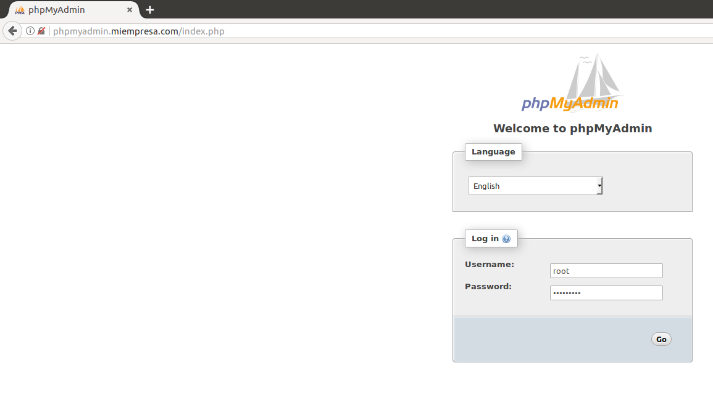

Creamos el usuario alumno.

Le damos todos los privilegios a este usuario.

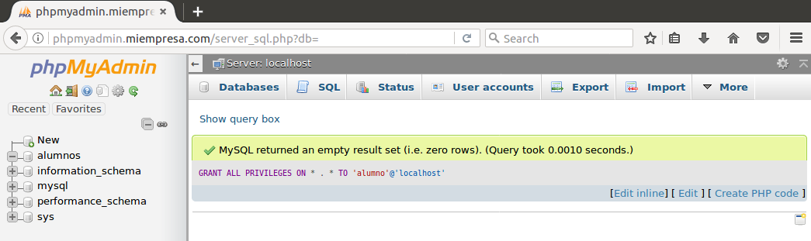

Creamos bases de datos llamada alumnos.

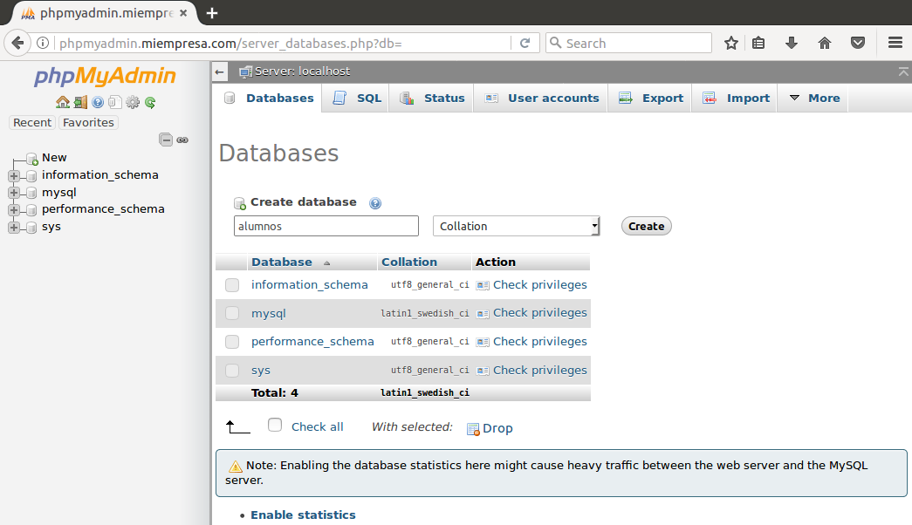

Descargamos Drupal de la plataforma Drupal.

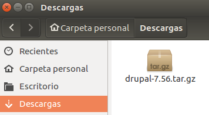

Descomprimimos en la carpeta.

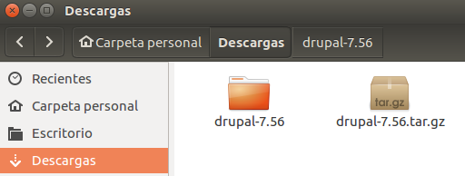

Movemos la carpeta descomprimida a `/var/www`.

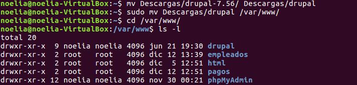

Establecemos la configuración en `/etc/apache2/sites-available`.

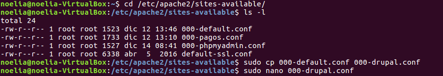

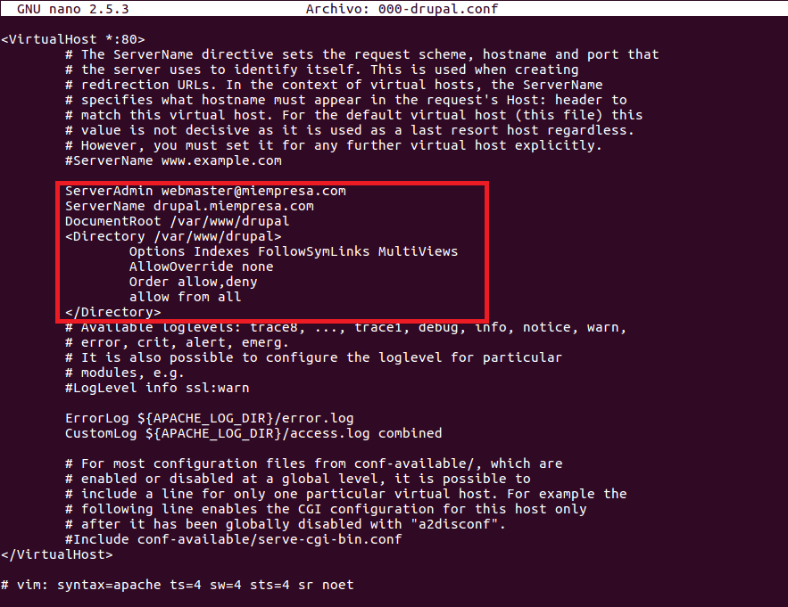

Creamos un enlace simbólico en `/etc/apache2/sites-enabled`.

Añadimos la línea `drupal.miempresa.com` en `/etc/hosts`.

Reiniciamos el Servicio de Apache.

Habilitamos el módulo SSL Apache con el comando sudo a2ensite 000-drupal.

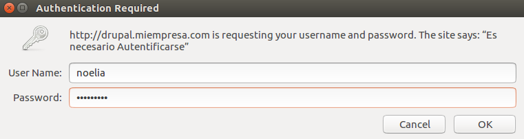

Comprobamos el acceso a `drupal.miempresa.com`. Dentro de aqui realizaremos la instalación y la configuración de la plataforma Drupal en la página principal.

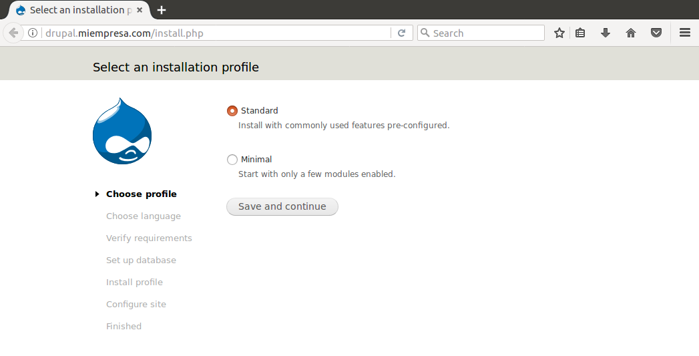

---
