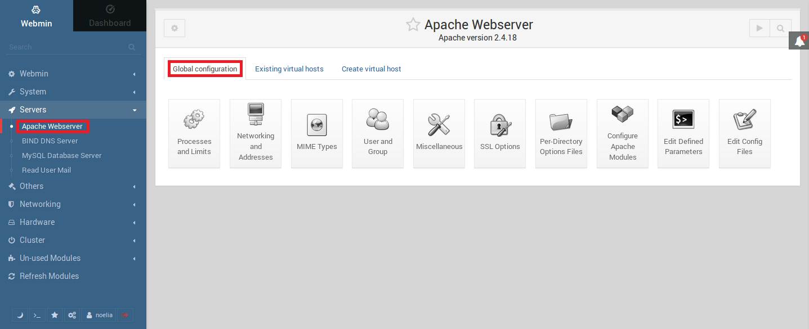

___

# **Panel De Control Hosting Web.**

---

En esta práctica vamos a utilizar el Webmin en la instalación y la configuración de un Panel de Control para servicio de hosting web en un Servidor.

---

# **1. Descarga De Webmin.**

Vamos a ir a la página oficial de [Webmin](http://www.webmin.com/).

Luego vamos a Download y nos descargamos por comandos Webmin con la dirección que nos aparece en la página, la versión para Ubuntu.

Confirmamos que se ha descargado bien Webmin.

---

# **2. Instalación De Webmin.**

Instalamos Webmin.

---

# **3. Configuración De Webmin.**

Introducimos en nuestro navegador la dirección `https://172.18.20.41:10000`.

Nos da un error de seguridad por tener un certificado autofirmado entonces añadimos una excepción de seguridad.

Volvemos a entrar y nos sale para introducir nuestro usuario y nuestra contraseña.

Con esto ya hemos podido acceder a Webmin.

---

# **4. Gestiones.**

Tenemos que hacer las gestiones dentro de la pestaña Server.

## **4.1. Gestión De Apache.**

Vamos a Apache Webserver.

En la primera pestaña del Apache Webserver podemos ver la configuración global.

En la segunda pestaña podemos ver los virtual host que ya tenemos creados en nuestro Servidor.

En la última pestaña podemos ver donde podemos crear nuevos virtual hosts.

## **4.2. Gestión De BIND DNS Server.**

Vamos a BIND DNS Server.

Podemos ver donde modificar las opciones globales del Servidor. En este apartado podemos ver el DNS de empresa20.com.

Entramos dentro de nuestro DNS existente.

Dentro de nuestro DNS podemos ver todos los alias y hosts que tenemos creados, para ello vamos a All Record Types.

## **4.3. Gestión De MySQL.**

Vamos a MySQL Database Server.

Para poder acceder al Servidor MySQL tenemos que entrar como root y poner una contraseña para este usuario.

Aquí vemos las base de datos creadas y más datos de cada una.

---
