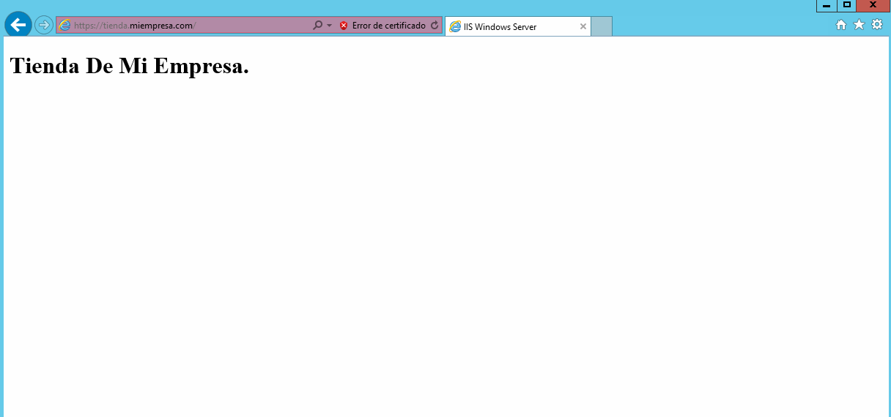
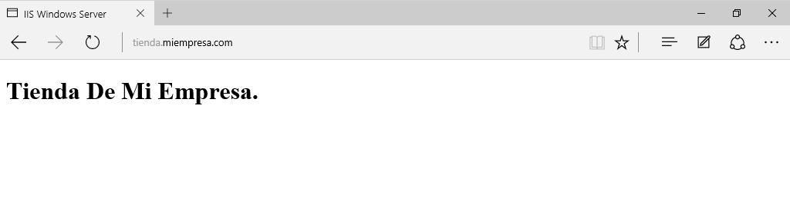
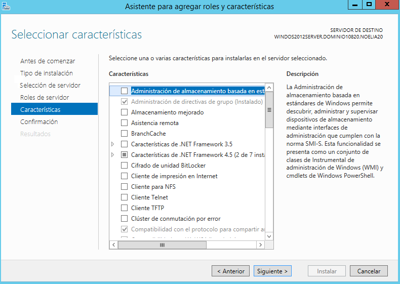
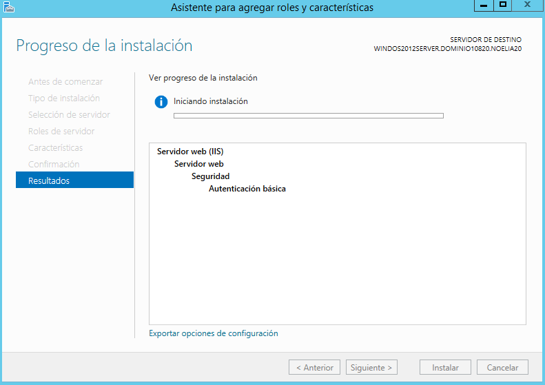
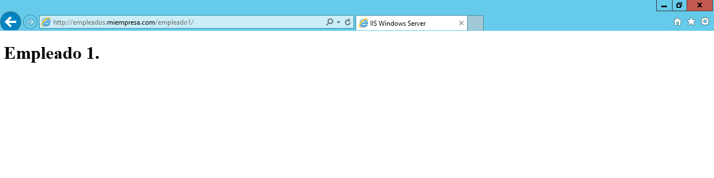

___

# **Instalación Y Configuración De Un Servidor Web Avanzado.**

---

## **Carpetas Seguras.**

* Creamos una nueva zona de búsqueda directa en los servicios DNS asociado al dominio miEmpresa.

  

  Creamos una zona de búsqueda directa.

  

  Nos sale el asistente para la nueva zona.

  

  Elegimos el tipo de zona que queremos.

  

  Seleccionamos que queremos que se repliquen los datos para todos los servidores DNS que se ejecutan en controladores de dominio en el dominio que tengo.

  

  Le ponemos un nombre a nuestra zona.

  

  Permitimos actualizaciones dinámicas seguras.

  

  Se ha creado la nueva zona.

  

  Ya contamos con otra zona de búsqueda directa.

  

* Creamos también una carpeta miEmpresa en C:\ y una subcarpeta ‘principal’.

  

  

* Creamos un nuevo sitio web denominado miEmpresa en IIS asociado a la subcarpeta  anterior y con acceso a través de la dirección www.miEmpresa.com.

  

  

  

  

* Actualizamos el DNS adecuadamente.

  

  

  

* Configuración A: Configuramos el nuevo sitio para que se pueda acceder (sólo) como sitio web seguro (https) con un Certificado Autofirmado.

  

  

  

  

* Creamos  un  nuevo  sitio web (denominado ‘pagos’) como subdominio de miEmpresa (pagos.miEmpresa.com) y configuramos este último para ser accedido de forma segura, vía ‘https’.

  

  

* Creamos el sitio web, asociado a una carpeta (miEmpresa\pagos) y con la configuración adecuada en los servicios DNS.

  

  

  

  

* Comprobamos el acceso (aún vía ‘http’ y vía ‘https’) con un navegador desde el propio Servidor y desde un Cliente W10.

  * Servidor.

    

    

  * Cliente.

    

    

* Configuración B: Crearemos un nuevo sitio seguro (tienda.miempresa.com) con la generación de un Certificado Digital a través de la aplicación OpenSSL. Para empezar, realizaremos la solicitud de un nuevo certificado de Servidor para nuestro sitio seguro (creamos fichero certreq.txt).

  

  

* Descargamos e instalamos OpenSSL para Windows.

  

  

  

  

  

  

  

* A través de OpenSSl generamos un nuevo certificado de servidor (y comprobando los ficheros generados en cada paso): generamos una clave privada de  la  entidad certificadora, creamos un certificado digital de la entidad certificadora y, finalmente, creamos un certificado digital de nuestra web.

  

  

  

* Importamos el nuevo certificado de servidor creado para completar la petición pendiente en nuestro sitio seguro ‘tienda’.

  

  

  

  

  

  

* Requerimos que nuestros sitio seguros sólo se pueda acceder mediante una conexión segura y reiniciar los sitios web.

  

  

* Finalmente, accedemos mediante http y mediante https a los sitios seguros desde el propio Servidor y desde un Cliente W10, aceptando los posibles problemas con la entidad certificadora.

  * Servidor.

    

    

  * Cliente.

    

    

---

## **Carpetas Privadas.**

Vamos a crear un nuevo sitio web (empleados.miEmpresa.com) destinado a almacenar información privada de los empleados, con las siguientes características.

* Necesitamos crear una carpeta empleados (dentro de miEmpresa) y, dentro de esta, cuatro subcarpetas personales con nombres de empleados y una, denominada común, a la que tendrán acceso todos los empleados, pero no otros usuarios sin identificar.

  

  

* Creamos un nuevo sitio web, como subdominio de nuestro dominio principal, asociado a la carpeta genérica empleados.

  

  

  

  

* Colocamos un fichero index.html diferente en cada una de las carpetas creadas, con el objetivo de poder comprobar el acceso desde un navegador.

  

  

  

  

* Para el sitio web creado y para cada una de sus carpetas, deshabilitamos el acceso anónimo.

  

  

  

  

* Agregamos la función de Autenticación Básica a nuestro Servicio de IIS a través de la Administración del Servidor.

  

  

  

  

  

  

  

  

  

  

* En Active Directory, crearemos un usuario para cada empleado (tantos   como carpetas personales) y un grupo Empleados que los incluya a todos.

  

  

  

  

  

  

* Desactivamos, para la carpeta empleados, los permisos heredables a través de las opciones avanzadas en la ficha de seguridad. Añadimos grupo de Administradores con Control Total y grupo Empleados con Lectura y Ejecución+ Mostrar Carpeta+Leer.

  

* Realizamos el mismo procedimiento para cada una de las carpetas personales de los empleados, colocando como usuarios autorizados el Grupo de Administradores (Control Total) y el empleado propietario de cada carpeta.

  

  

* Realizamos el mismo procedimiento para la carpeta ‘comun’, colocando   como usuarios autorizados el Grupo de Administradores (Control  Total) y el grupo Empleados.

  

  

* Comprobamos el acceso, tanto desde el servidor como desde el cliente W10, a las diferentes carpetas con distintos usuarios.

  

  * Servidor.

    

    

    

    

  * Cliente.

    

    

    

    

---
