___

# **Servidor Web Avanzado 2.**

---

## **Instalación De PHP, MySQL Y PHPMyAdmin.**

Vamos a realizar las instalaciones y configuraciones necesarias para obtener un Servidor Web con soporte PHP y accesos a bases de datos relacionales, acceso FTP y gestor de bases de datos. Sobre este Servidor, podremos realizar instalaciones de aplicaciones integradas (CMS, e-commerce, etc) desde el propio Servidor o en modo remoto desde un Cliente W10.

Instalamos el soporte para PHP para tus sitios Web gestionados por IIS. Se recomienda PHP 5.3.9 nts Win32 VC9 x86 msi Non Thread-Safe (con IIS Fast CGI).

Para descargarnos IIS Fast CGI vamos al panel de Administración de Servidor y agregamos roles/características y agremos el rol de CGI.

MSI Installer para Windows nos descargarmos la versión de PHP, para ello vamos a la página de [PHP](windows.php.net/downloads/releases/archives).

Configuramos luego IIS para que admita el fichero index.php por defecto en las carpetas y/o sitios que nos interese.

Comprobamos la instalación correcta de PHP colocando un fichero index.php en el sitio web destinado a gestionar el CMS Drupal (www.miEmpresa.com ó miEmpresa\principal) con el siguiente código: <?php phpinfo(); ?>

Siguiendo los pasos detallados en las guías y tutoriales, instala el servidor de bases de datos relacionales MySQL para tus sitios Web gestionados por IIS. Descargar para ello el paquete instalador de http://dev.mysql.com/downloads/installer/.
* Descargar e instalar .NET Framework 4.0.
* Instalar MySQL y complementos necesarios.

Siguiendo los pasos detallados en las guías y tutoriales, instala PHPMyAdmin para tus sitios Web gestionados por IIS. Para esto debes crear un nuevo sitio web asociado a phpmyadmin.miEmpresa.com, recordando crear la correspondiente carpeta (donde descomprimirás los ficheros de phpMyAdmin) y actualizar DNS.

---

## **Instalación De Servidor FTP Y CMS Drupal.**

Instalamos Servidor FTP FileZilla en Windows 2012 Server. Nos descargamos Filezilla en la página de [Filezilla](http://filezilla-project.org/download.php?type=server).

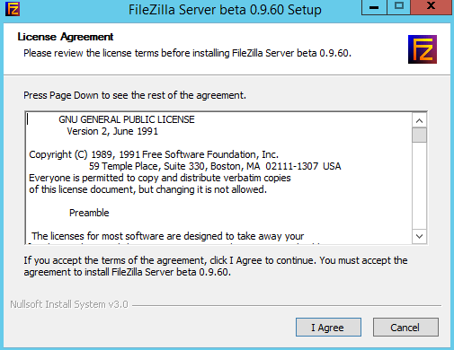

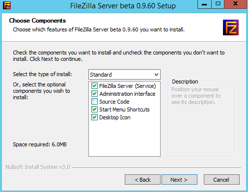

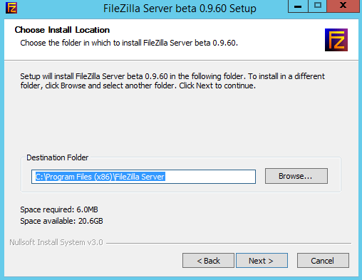

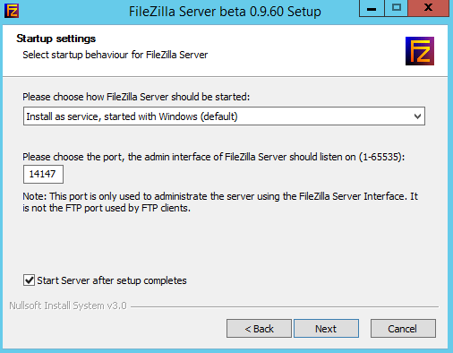

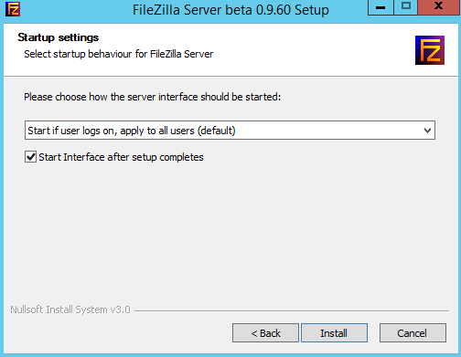

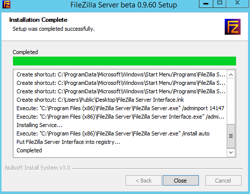

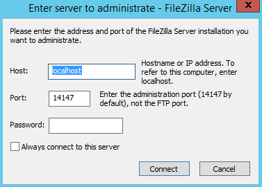

Creamos un usuario denominado `ftpuserp` en el Servidor FTP y le asociamos a este usuario permisos de Control Total sobre la carpeta en la que se va a instalar el CMS de miEmpresa.

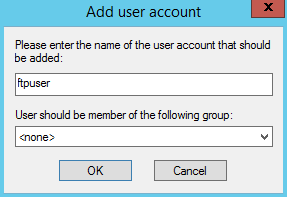

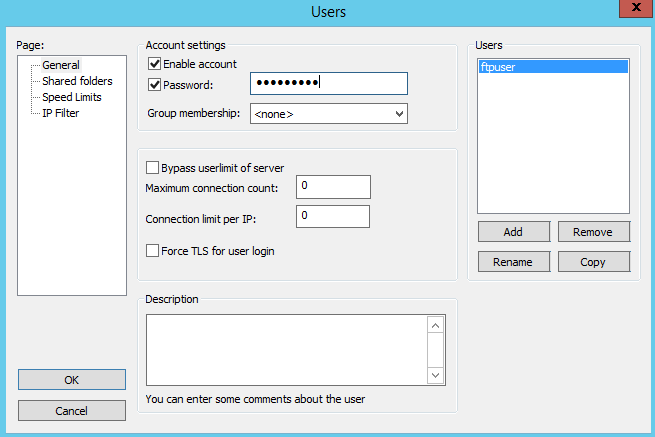

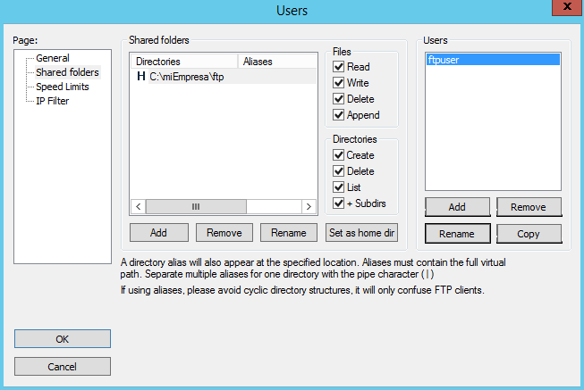

Creamos un nuevo registro DNS que nos permita acceder a nuestro sitio FTP a través de la dirección `ftp.miEmpresa.com`.

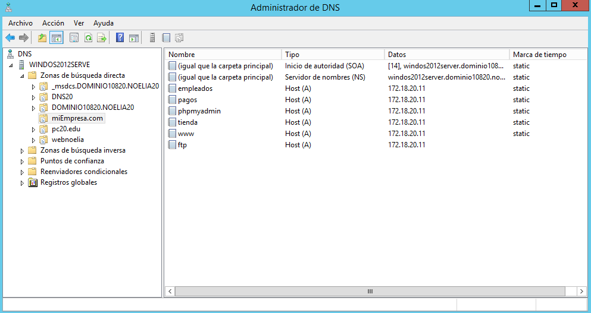

Comprobamos el acceso al sitio FTP a través de un navegador desde localhost y a tráves de la dirección `ftp.miEmpresa.com`, todo esto conectandonos con el usuario que hemos creado anteriormente.

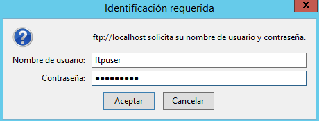

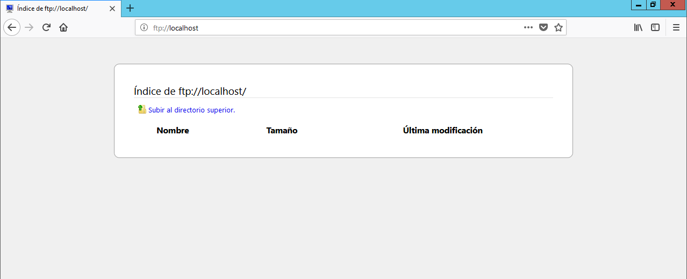

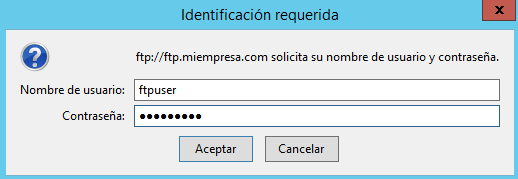

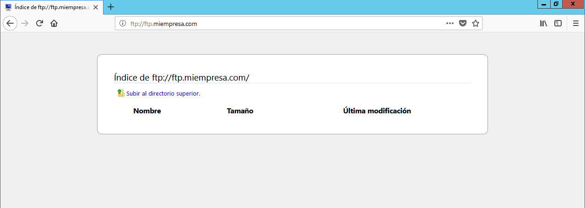

A partir de ahora realizaremos todo desde el cliente Windows 10.

Comprobamos el acceso a phpMyAdmin desde un navegador (phpmyadmin.miEmpresa.com).

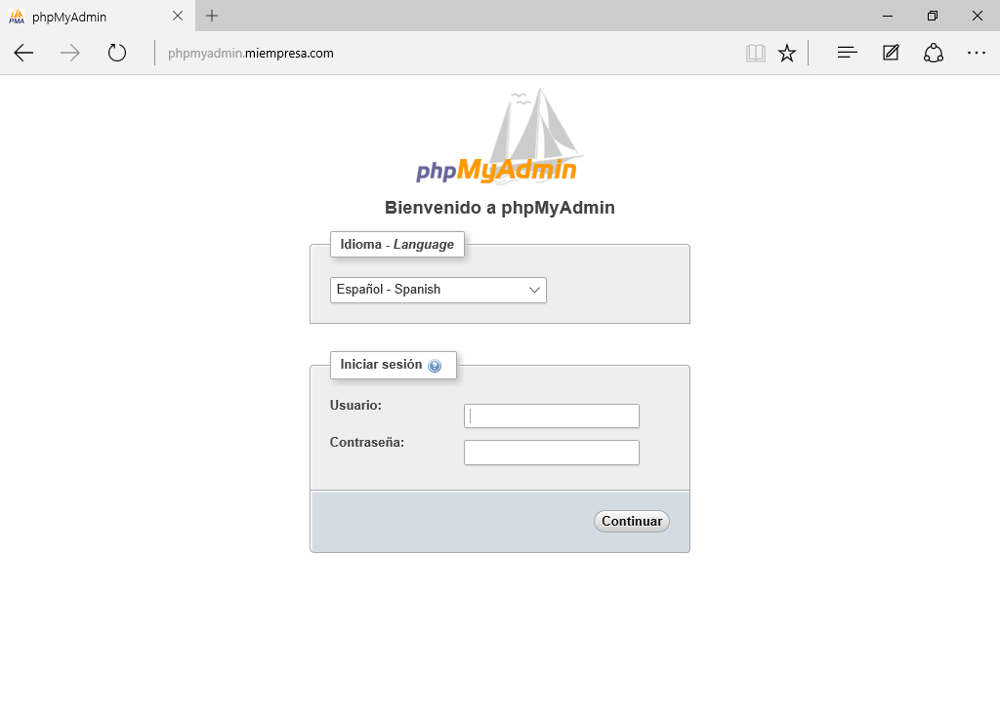

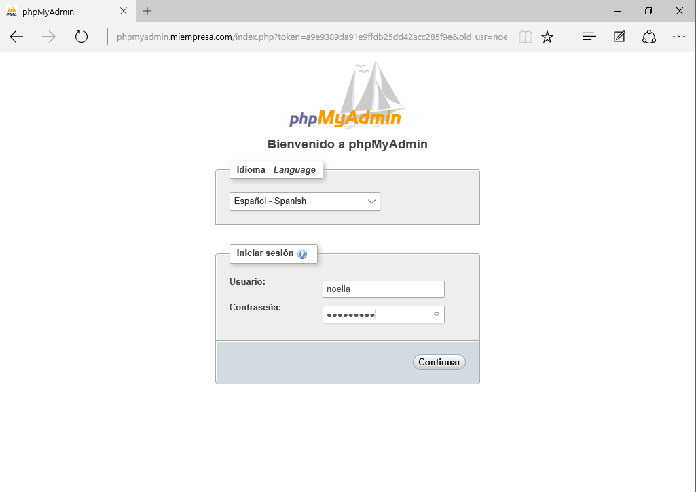

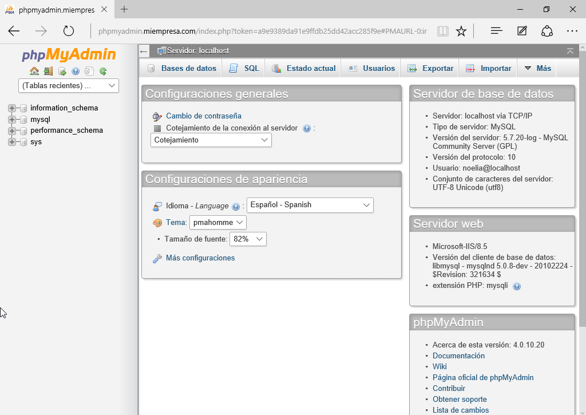

----------------------------------------------------------------------------------------------

Descargamos CMS Drupal de drupal.org. Nos descargamos Drupal en la página de [Drupal](http://drupal.org/project/drupal)

Comprobamos el acceso al sitio FTP creado a través de un navegador y con el usuario ftpuser.

Instalamos un Cliente FTP (p.e.: FileZilla) en Windows 10 para poder realizar todas las operaciones sobre los ficheros y carpetas del servidor web. Nos descargamos Filezilla en la página de [Filezilla](http://filezilla-project.org/download.php?type=client).

* Descomprimir y subir archivos Drupal a carpeta principal (www.miEmpresa.com).
* Crear una nueva base de datos, denominada cms, a través de phpMyAdmin.
* Crear usuario cms y asignar todos los privilegios para la base de datos anterior.
* Instalar CMS Drupal desde el navegador siguiendo los pasos y consultando documentación en Internet.
* Configuración y creación del sitio Drupal: configurar idioma español; instalar módulo gtranslate y habilitar traducción a varios idiomas; instalar y configurar temas Marinelli, Zen y Fusion; crear dos o tres páginas de contenido, crear menú Primary Links y colocar como bloque. Otras opciones de configuración que desees.

---

## **Instalación Y Configuración De Aplicaciones Web Integradas.**

Elige una de las siguientes aplicaciones web integradas basadas en software libre y realiza, en grupos de hasta tres alumnos, su instalación y configuración en tu servidor web, siempre en modo remoto, desde el cliente W7 (excepto la creación del sitio web IIS –subdominio de miEmpresa-, carpeta física y configuración DNS y FTP necesarios).

Consulta la amplia documentación disponible en Internet:

* Galería fotográfica: Gallery o Coppermine.
* Tienda Virtual: osCommerce
* Formación online: Moodle
* Blog: Wordpress
* Foros: SMF

---
