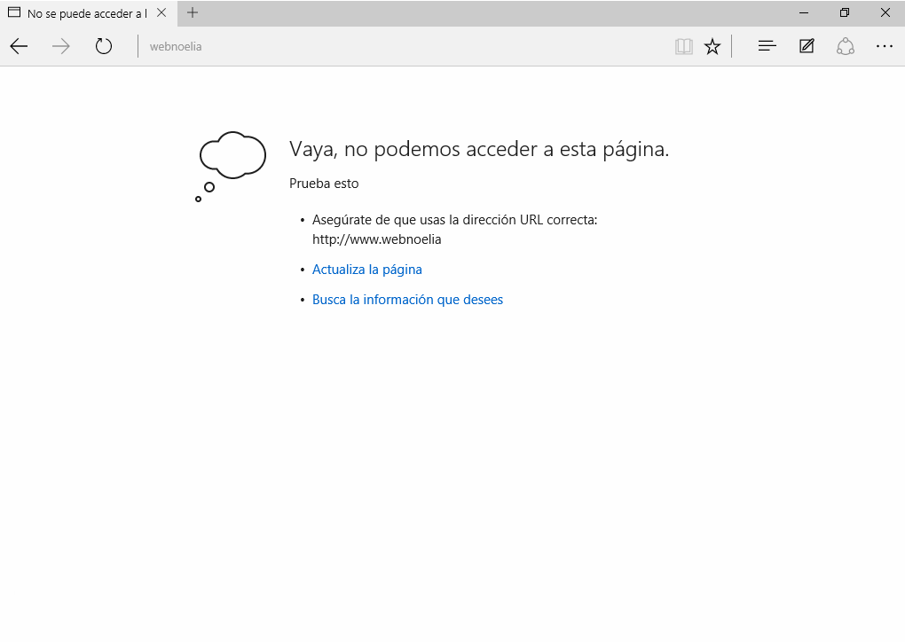
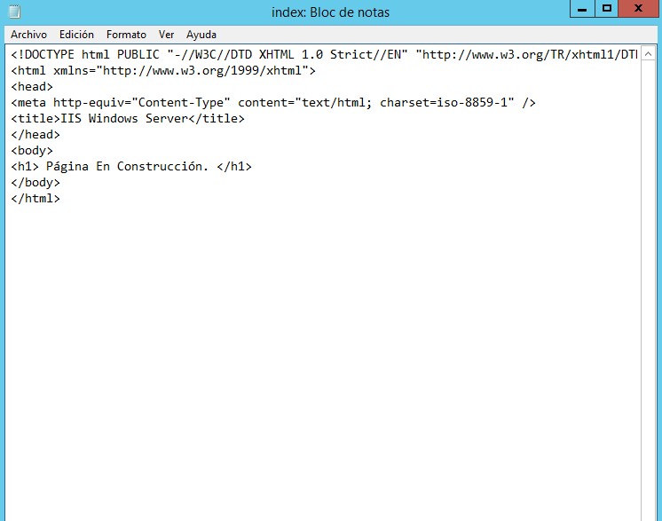
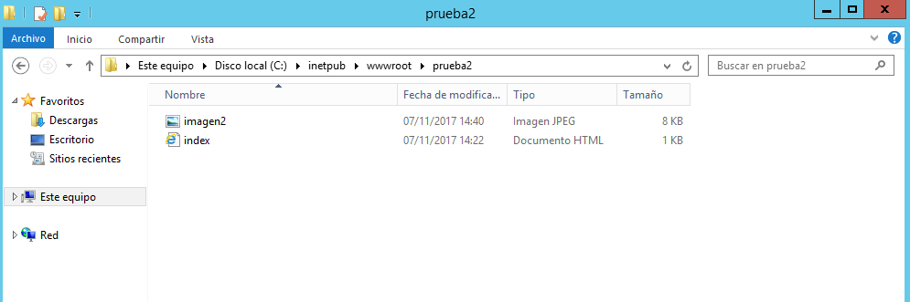
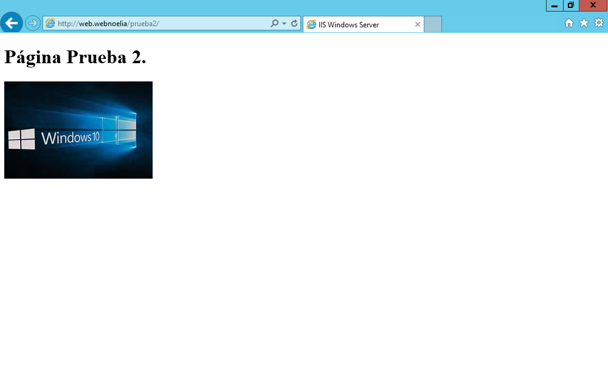
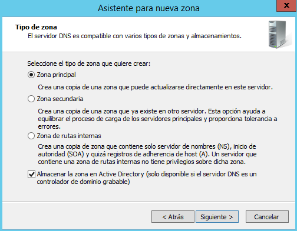
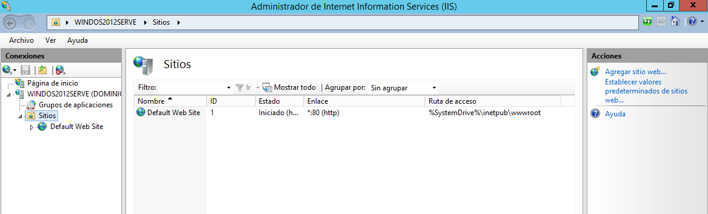
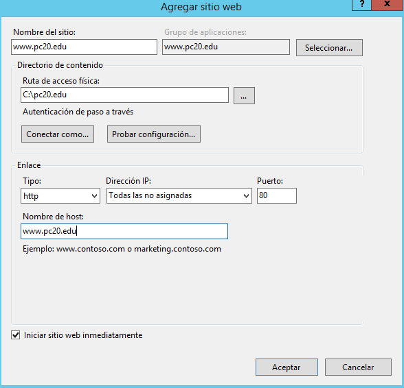
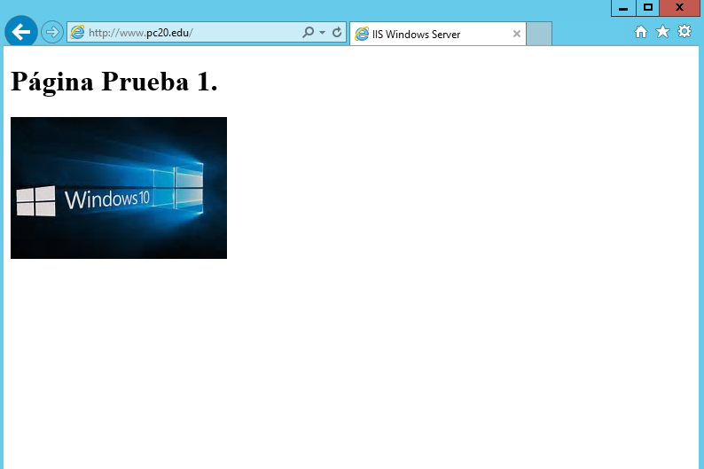
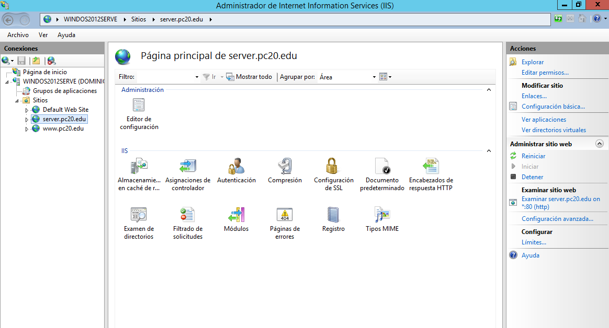

___

# **Servidor Web Básico.**
___

## **Instalación, Configuración Y Creación De Sitios Web.**

Instalamos IIS en Windows 2012 Server (Asistente para Configurar Servidor, Servidor de Aplicaciones IIS). Incluimos Autenticación Básica y de Windows.

Lo primero que tenemos que hacer es ir a Administrador del Servidor.

Luego tenemos que ir a Administrar y vamos a Agregar roles y características.

El resto de pasos los realizamos como se pueden ver en las imágenes.

Finalmente terminamos la instalación del IIS en Windows 2012 Server.

Ahora comprobamos el acceso a nuestro Servidor Web (localhost) desde un navegador web (debe aparecer una página en construcción).

Entramos en el Cliente Windows 10 y accedemos, desde un navegador web, a la página principal del Servidor a través de la IP del Servidor.

Ahora en la configuración DNS creamos una nueva zona de búsqueda directa, dentro de aqui creamos un dominio y un alias..

Accedemos ahora desde W10 a la misma página mediante el nombre principal del dominio y desde cualquier otro alias que haya sido definido en la configuración DNS.

Tratamos de acceder desde W10 al sitio www del dominio principal.

Lo que nos ocurre es que nos da un error porque el alias de www no esta creado en la configuración DNS.

Añadimos un alias en el servicio DNS que relacione el sitio www con el dominio principal.

Intentamos ahora acceder desde W10.

Creamos una página web HTML sencilla (index.htm) como página principal de mi dominio y la colocamos en C:\Inetpub\wwwroot.

Comprobamos el acceso a esta página desde el propio Servidor y desde el Cliente, utilizando los diferentes alias y direcciones configurados en el servicio DNS.

* Servidor.

* Cliente.

Creamos un pequeño sitio web con varias páginas e imágenes organizadas en subcarpetas de wwwroot.

Accedemos y navegamos por el sitio web tanto desde el Servidor como desde el Cliente W10.

* Servidor.

* Cliente.

---

## **Creación De Sitios Web Independientes.**

Ahora en la configuración DNS creamos una nueva zona de búsqueda directa, dentro de aqui creamos un dominio y varios alias.

Creamos dos nuevos sitios web, uno asociado al dominio principal y otro a un subdominio, estos dos sitios webs seran independientes.

Finalmente, incorporamos algunos archivos HTML, imágenes y subcarpetas a mi nuevo sitio web y comprobamos el acceso desde navegadores web tanto del Servidor como del Cliente W10.

---

## **Creación De Directorios Virtuales.**

Siguiendo  los  pasos  detallados  en  el  documento  PDF  de  Instalación  y  Configuración  IIS,  
apartado  3  sobre  creación  de  directorios  virtuales,  crea  una  carpeta  que  se  corresponda  
con una posible sección del sitio web creado en la práctica anterior (creación de sitios web
independientes).  Crea  un  nuevo  directorio  virtual  en  IIS  (dentro  del  citado  sitio  web)  y  
relaciónalo con la carpeta que has cre
ado.

* Este directorio virtual debe contener, al menos, tres subcarpetas con páginas html diferentes para  comprobar el buen funcionamiento del sitio. Por ejemplo, tu directorio virtual podría ser departamentos, con tres subcarpetas contabilidad, administración  e informática y acceso a través de la URL servicios.srd.edu o departamentos.srd.edu.

* Comprobamos el acceso a cada una de las diferentes secciones de nuestro sitio web, tanto desde el Servidor como desde el Cliente W10.

* Recuerda realizar las configuraciones DNS necesarias para que los diferentes nombres que se han ido creando referentes a nuestro sitio web sean resueltos correctamente.

* Finalmente, elige los documentos que serán mostrados por defecto en cada uno de los sitios y directorios virtuales creados y el orden de prioridad entre ellos.

---
