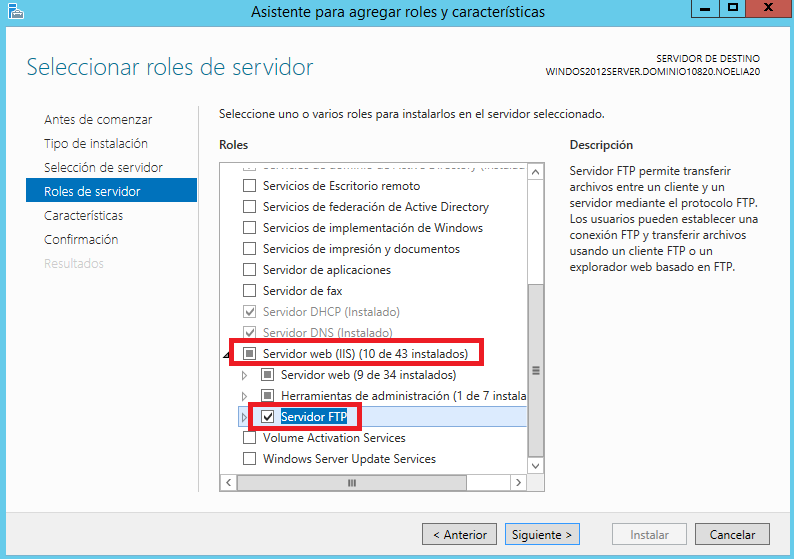
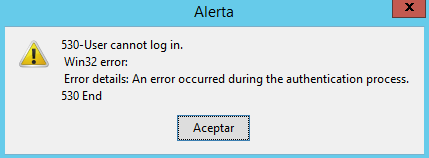
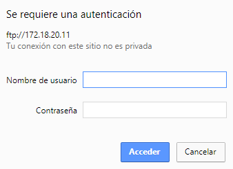
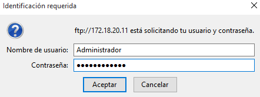
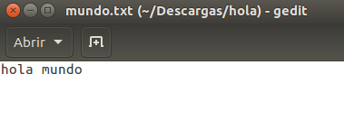
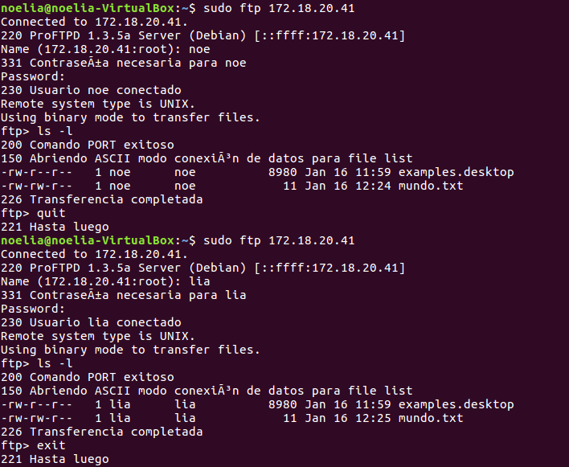

___

# **Instalación Y Configuración Del Servicio FTP En Windows 2012 Server.**

---

Desinstalamos el Filezilla en Windows 2012 Server.

Instalamos el Servicio FTP en Windows 2012 Server, a través de Agregar roles y características (IIS).

Lo primero que tenemos que hacer es ir a Administrador del Servidor.

Luego tenemos que ir a Administrar y vamos a Agregar roles y características.

El resto de pasos los realizamos como se pueden ver en las imágenes.

Finalmente terminamos la instalación del Servicio FTP en Windows 2012 Server.

Accedemos a la creación y configuración de Sitios FTP por medio de la Administración de IIS.

Debemos ir a Herramientas y luego a Administrador de Internet Information Services (IIS) para poder crear tres nuevos sitios FTP.

Creamos tres nuevos sitios FTP, en todos ellos debemos poder acceder a través de la IP del Servidor, 172.18.20.11.

* Primer Sitio FTP.

  

  El primero dominio estará asociado a la unidad C: completa.

  

  Sin uso de SSL.

  

  No se debe permitir accesos anónimos. Sólo el usuario Administrador podrá acceder al sitio. Modos de lectura y de escritura.

  

  

  * Examinamos todas las opciones de configuración de la página principal de tu Sitio FTP (IIS) y vemos lo siguiente.

    El Aislamiento de usuario FTP es para que un usuario no pueda acceder a carpetas anteriores del árbol.

    La autentificación FTP es para dar acceso anónimo o acceso básico.

    La compatibilidad con el firewall es para comprobar el firewall.

    La configuración SSL de FTP es para configurar los certificados SSL.

    El examen de directorios es para ver como es el estilo de la lista de directorios.

    El filtrado de solicitudes es para no permitir a ciertas máquinas.

    Los mensajes de FTP.

    El registro FTP es donde se guarda el registro de los errores y accesos de nuestro FTP.

    Las reglas de autorización son las distintas reglas de permisos a los usuarios.

    Las restricciones direcciones IP.

    Las sesiones actuales son las sesiones activas en este momento.

  * Tratamos de acceder al sitio FTP desde el propio Servidor a través de un navegador. Comprobamos accesos permitidos y denegados, por ejemplo, con otro usuario que no exista en nuestro Servidor y como ningún usuario con ninguna contraseña.

    

    

    

    

    

    

    

  * Accedemos ahora desde un Cliente Windows de la misma forma. Realizamos las mismas comprobaciones que en el Servidor.

    

    

    

    

  * Instalamos el software WinSCP en el Cliente Windows.

    

    

    

    

    

    

    

    

    

  * Configuramos la conexión al sitio FTP y tratamos de establecer conexión y realizamos comprobaciones.

    

    

* Segundo Sitio FTP.

  

  El segundo dominio estará asociado al directorio wwwroot de Inetpub.

  

  Habilitamos en este caso la posibilidad de conexiones SSL asociadas a uno de los certificados que poseemos en IIS.

  

  No permitimos acceso anónimo y se permitirá el acceso a todos los usuarios de Active Directory en modo lectura y escritura.

  

  

  * Realizamos comprobaciones válidas e inválidas de conexión y operaciones, tanto desde el Servidor como desde el Cliente, por ejemplo, con el usuario Administrador, con otro usuario que no exista en nuestro Servidor y como ningún usuario con ninguna contraseña.

    

    

    

    

    

    

    

    

    

    

    

  * Realizamos una configuración de conexión SSL desde WinSCP.

    

    

    

* Tercer Sitio FTP.

  

  El tercer dominio estará asociado a una carpeta cualquiera del Servidor que contenga información (archivos y carpetas), pero que no sea importante.

  

  

  Permitiremos acceso anónimo y sólo se podrá consultar y leer.

  

  

  * Comprobamos desde el Servidor y desde el Cliente.

    

    

    

  * Realizamos una configuración de conexión SSL desde WinSCP.

    

    

    

    

Debemos crear un nuevo registro DNS que permita acceder a nuestro sitio FTP a través de la dirección ftp.pc20.edu.

En un principio es posible que debas detener un sitio web para que pueda iniciarse otro. Tras comprobar el funcionamiento por separado de los sitios, hemos encontrado una solución para que nuestro Servidor ofrezca varios sitios FTP simultáneamente. Para poder realizar esta acción tenemos que darles a cada sitio FTP un puerto diferente.

* Segundo Sitio FTP.

  

  

  

* Tercer Sitio FTP.

  

  

  

Realizamos comprobaciones válidas de conexión tanto desde el Servidor como desde el Cliente.

* Desde el Servidor.

  

  

  

  

  

  

  

  

* Desde el Cliente.

  

  

  

  

  

Realizamos una configuración de conexión SSL desde WinSCP de los tres sitios FTP.

---

# **Instalación Y Configuración Del Servicio FTP En Linux.**

---

Instalamos el Servicio SSH en el Servidor Linux.

Creamos dos usuarios en el sistema.

Comprobamos, desde una máquina Cliente, acceso de los usuarios mediante ssh. Tratamos de ejecutar una aplicación gráfica del servidor de forma remota, desde el Cliente, mediante ssh, para ello instalamos el geany.

Accedemos, también desde el Cliente, mediante sftp al sistema de ficheros del Servidor y probar acceso, carga y descarga de archivos con ambos usuarios.

Realizamos varias copias de archivos hacia / desde el servidor mediante scp, utilizando también los dos usuarios creados anteriormente.

Instalamos el paquete proftpd.

Tratamos de conectar al servicio ftp gestionado por proftpd tanto desde el Servidor como desde un Cliente. También probamos el acceso al ftp mediante los usuarios creados y realizando diferentes operaciones de listado, subida y descarga de archivos.

---
