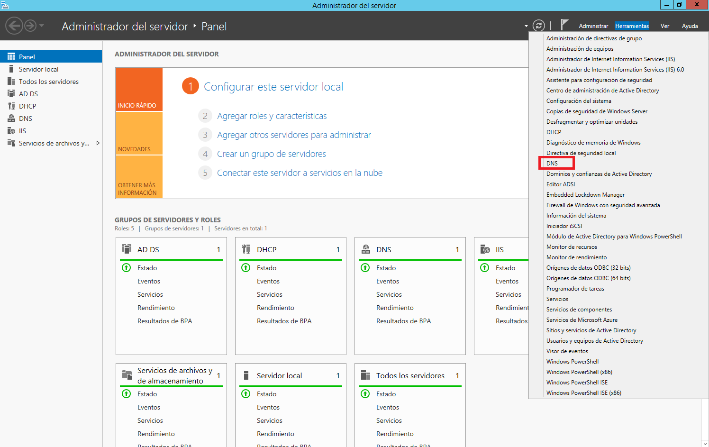
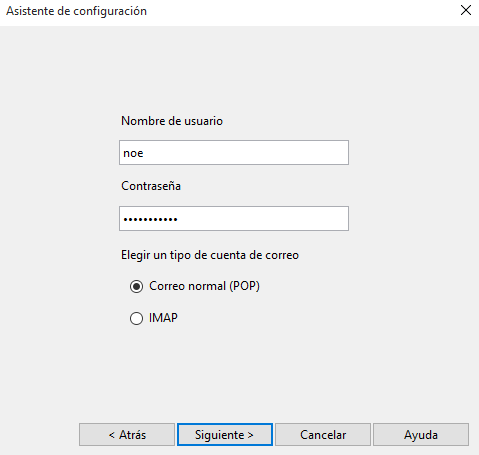
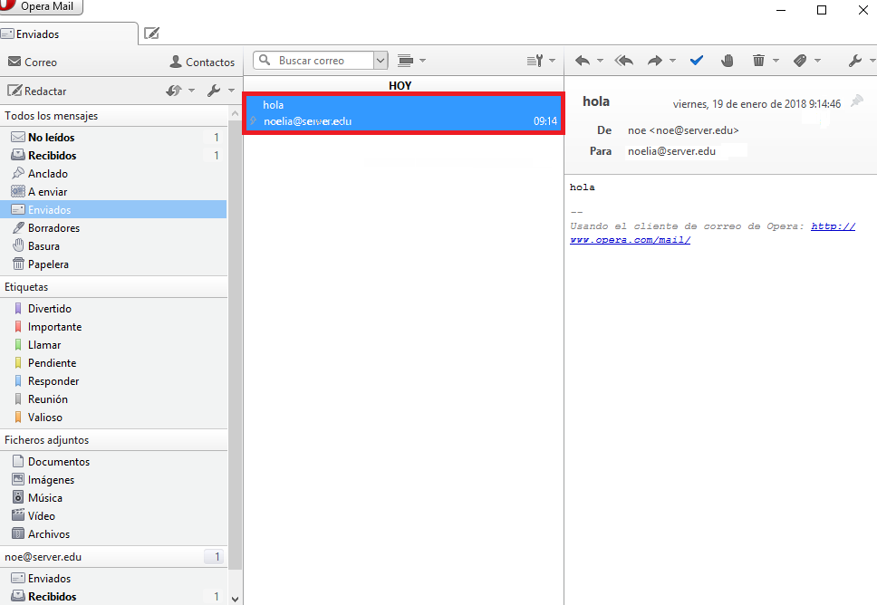
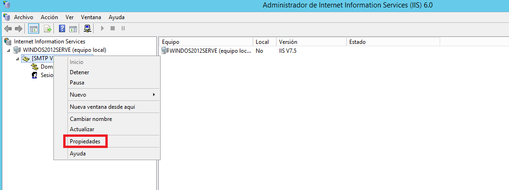
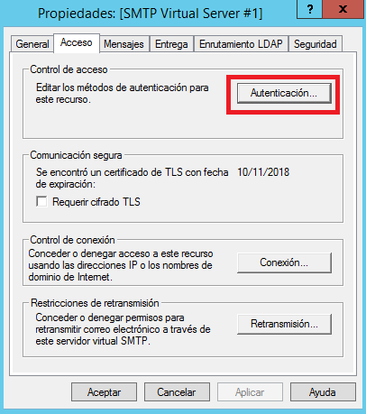
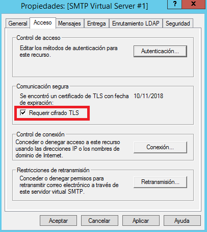
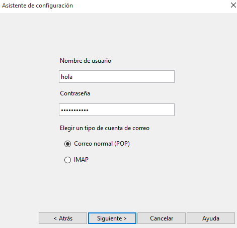
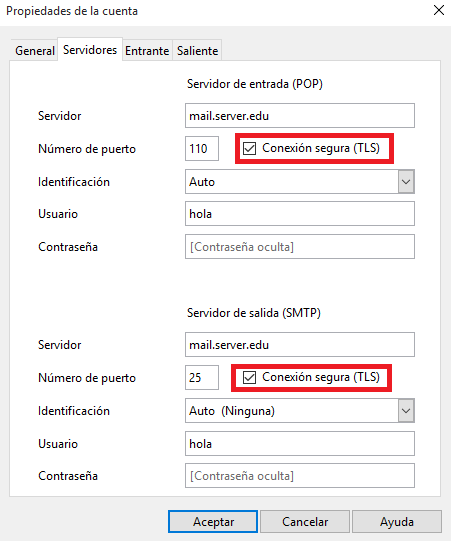
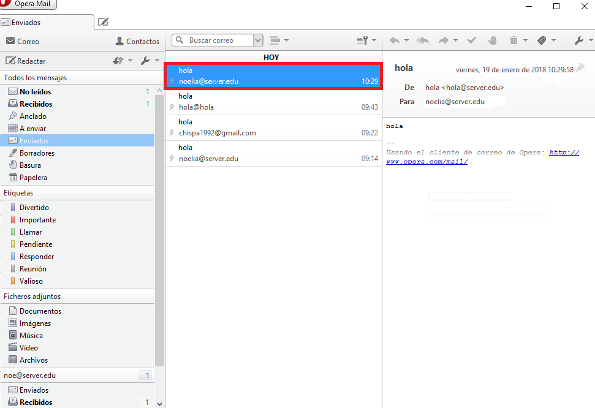

___

# **Práctica Servicio SMTP Windows 2012 Server.**

---

## **Instalación Y Configuración De Un Servidor De Correo SMTP.**

---

Instalamos el Servicio SMTP en Windows 2012 Server utilizando el Asistente.

Lo primero que tenemos que hacer es ir a Administrador del Servidor.

Luego tenemos que ir a Administrar y vamos a Agregar roles y características.

El resto de pasos los realizamos como se pueden ver en las imágenes.

Finalmente terminamos la instalación del Servicio SMTP en Windows 2012 Server.

La configuración del Servicio SMTP la haremos a través del Administrador de aplicaciones (IIS) 6.0.

Lo que tenemos que hacer es ir a Administrador del Servidor.

Luego tenemos que ir a Herramientas y vamos a Administrador de Internet Information Services (IIS) 6.0.

Realizamos la configuración en las propiedades de SMTP.

  * Establecemos como IP todas las asignadas. Limitamos el número de conexiones a 50. Habilitamos el registro en formato W3C, diario y en una carpeta determinada.

    

    

  * Configuramos el envío de mensajes dentro de nuestra red local. Aceptamos la conexión al Servidor y la retransmisión de mensajes a todos los equipos menos los que aparecen en la lista, incluimos una IP cualquiera en la lista para impedimos su acceso y retransmisión, en concreto 172.18.20.20.

    

    

    

    

    

    [imagen022](./images/instalacion_y_configuracion_de_servicios_de_correo_electronico_windows/022.png)

  * Establecemos autenticación anónima.

    

    

  * Echamos un vistazo al resto de opciones de configuración del Servidor.

    

    

    

    

  * Aplicamos cambios y reiniciamos el Servicio.

    

    

    

    

  * Comprobamos la existencia del dominio AD predeterminado. Creamos un dominio de tipo alias para disponer de cuentas en otro dominio.

    

    

    

    

    

  * Creamos un nuevo DNS.

    Lo primero que tenemos que hacer es ir a Administrador del Servidor.

    

    Luego a DNS para poder crear una nueva zona de búsqueda directa en el Servidor.

    

    

    Creamos una zona de búsqueda directa.

    

    Nos sale el asistente para la nueva zona.

    

    Elegimos el tipo de zona que queremos.

    

    Seleccionamos que queremos que se repliquen los datos para todos los servidores DNS que se ejecutan en controladores de dominio en el dominio que tengo.

    

    Le ponemos un nombre a nuestra zona.

    

    Permitimos actualizaciones dinámicas seguras.

    

    Se ha creado la nueva zona.

    

    Ya contamos con otra zona de búsqueda directa.

    

    En la zona de búsqueda directa añadimos un host nuevo (A).

    

    Un host para el Servidor denominado mail.

    

    Ya tenemos este registros creado.

    

  * Comprobamos la carpetas de correo creados en `C:\Inetpub\mailroot`.

    

    * En el cliente Windows:

      Comprobamos el acceso al nuevo nombre DNS creado en el Servidor.

        

      Configuramos el Cliente de correo Live mail agregando dos cuentas de correo cualesquiera. Deberemos especificar el usuario/buzón, la contraseña y el Servidor SMTP.

        

        

        

        

        

         <- recortar.

        

        

        

        

        

        

      Enviamos varios correos desde / hacia las diferentes cuentas y comprobar envío (real o ficticio) y carpetas mailroot. Las carpetas existentes en mailroot alojan mensajes en cola (Queue) y mensajes entregados (Drop).

        

         <- revisar correo.

        

        

        

        

        

        

         <- revisar correo.

        

        

    * En el Servidor.

      Tenemos que añadir una nueva configuración de Servicio SMTP a través del administrador de aplicaciones (IIS) 6.0.

      Lo que tenemos que hacer es ir a Administrador del Servidor.

        

      Luego tenemos que ir a Herramientas y vamos a Administrador de Internet Information Services (IIS) 6.0.

        

        

      Realizamos la configuración en las propiedades de SMTP.

        

        

      Establecemos la autenticación básica de Windows.

        

        

      Probamos diferentes configuraciones de dominio predeterminado, por ejemplo, cifrado TLS.

        

        

    * En el Cliente Windows:

      Configuramos las cuentas según los parámetros especificados en el Servidor.

        

         <- falta.

         <-recortar.

        

        

        

        

        

        

         <- cambiar usuario.

         <- arreglar.

         <- recortar.

        

        

        

        

      Enviamos varios correos desde / hacia las diferentes cuentas y comprobar envío y carpetas mailroot. En este caso sólo tendrán acceso al servidor SMTP cuentas del dominio y correspondientes a usuarios de AD.

        

        

        

        

        

        

        

        

---

# **Práctica hMailServer Windows 2012 Server.**

---

## **Configuración De hMailServer En Windows Server 2012.**

---

Queremos configurar un servidor de correo para nuestra red local, para que los usuarios de nuestra red puedan comunicarse por correo electrónico.

En primer lugar, hay que desinstalar el Servicio SMTP de Windows 2012 Server.

Debes descargar e instalar en el Servidor Windows 2012 Server el Servidor de correo hMailServer.

Crea dos dominios denominados srd.edu y asir.edu.

Ejecuta los diagnósticos para ambos dominios y soluciona el error de backup asignando una carpeta para tal fin. Establece copia de seguridad de los mensajes.

Creamos dos cuentas para dos usuarios ficticios en cada uno de los dos dominios. Configuramos las cuentas con diferentes opciones (cuota de disco, auto-reply, forwarding, signature, etc.)

Configuramos el servicio DNS para crear las entradas `mail.srd.edu` y `mail.asir.edu` que apunten a la dirección ip del Servidor Windows 2012.

Realiza todas las opciones de configuración que consideres necesarias y/o convenientes. Consulta para ello los tutoriales cuyos enlaces se proporcionan (opciones de protocolos SMTP, POP e IMAP, rangos de IP, bloqueo de correo entrante, nombre de host, reenvío dominios remotos, blacklists, opciones de logging, etc.) (tutoriales)

Configura en el cliente W10 un Cliente de correo como thunderbird o Live Mail (en los ordenadores clientes) para acceder al Servidor de correo instalado en Windows 2012.

Realiza prueba de envío y recepción de correos entre los diferentes usuarios, comprobando, además de envío y recepción correctas, el efecto de las opciones configuradas en las cuentas.

Crea una lista de distribución empleados asociada al dominio y añade a los dos usuarios de miempresa.com a ella.

Realiza prueba de envío y recepción de correos por medio de la lista de distribución.

---
