___

# **Práctica Servicio SMTP Windows 2012 Server.**

---

## **Instalación Y Configuración De Un Servidor De Correo SMTP.**

---

Instalamos el Servicio SMTP en Windows 2012 Server utilizando el Asistente.

Lo primero que tenemos que hacer es ir a Administrador del Servidor.

Luego tenemos que ir a Administrar y vamos a Agregar roles y características.

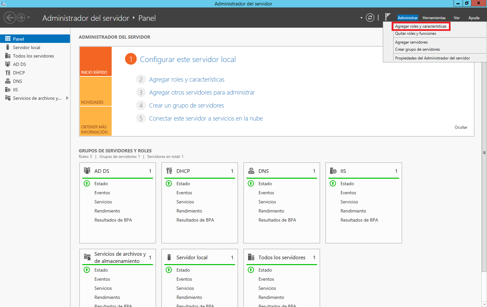

El resto de pasos los realizamos como se pueden ver en las imágenes.

Finalmente terminamos la instalación del Servicio SMTP en Windows 2012 Server.

La configuración del Servicio SMTP la haremos a través del Administrador de aplicaciones (IIS) 6.0.

Lo que tenemos que hacer es ir a Administrador del Servidor.

Luego tenemos que ir a Herramientas y vamos a Administrador de Internet Information Services (IIS) 6.0.

Realizamos la configuración en las propiedades de SMTP.

* Establecemos como IP todas las asignadas, en mi caso, 172.18.20.11. Limitamos el número de conexiones a 50. Habilitamos el registro en formato W3C, diario y en una carpeta determinada.

  

  

* Configuramos el envío de mensajes dentro de nuestra red local. Aceptamos la conexión al Servidor y la retransmisión de mensajes a todos los equipos menos los que aparecen en la lista, incluimos una IP cualquiera en la lista para impedir su acceso y retransmisión, en concreto la 172.18.20.20.

  

  

  

  

  

  

* Establecemos la autenticación anónima.

  

  

* Echamos un vistazo al resto de opciones de configuración del Servidor.

  

  

  

  

* Aplicamos cambios y reiniciamos el Servicio.

  

  

  

  

* Comprobamos la existencia del dominio AD predeterminado. Creamos un dominio de tipo alias para disponer de cuentas en otro dominio.

  

  

  

  

  

* Creamos un nuevo DNS.

  Lo primero que tenemos que hacer es ir a Administrador del Servidor.

  

  Luego a DNS para poder crear una nueva zona de búsqueda directa en el Servidor.

  

  

  Creamos una zona de búsqueda directa.

  

  Nos sale el asistente para la nueva zona.

  

  Elegimos el tipo de zona que queremos.

  

  Seleccionamos que queremos que se repliquen los datos para todos los servidores DNS que se ejecutan en controladores de dominio en el dominio que tengo.

  

  Le ponemos un nombre a nuestra zona.

  

  Permitimos actualizaciones dinámicas seguras.

  

  Se ha creado la nueva zona.

  

  Ya contamos con otra zona de búsqueda directa.

  

  En la zona de búsqueda directa añadimos un host nuevo (A).

  

  Un host para el Servidor denominado mail.

  

  Ya tenemos este registro creado.

  

* Comprobamos la carpetas de correo creados en `C:\Inetpub\mailroot`.

  

  * En el Cliente Windows.

    Comprobamos el acceso al nuevo nombre DNS creado en el Servidor.

    

    Configuramos el Cliente de correo Live mail agregando dos cuentas de correo cualesquiera. Deberemos especificar el usuario/buzón, la contraseña y el Servidor SMTP.

    

    

    

    

    

    

    

    

    

    

    

    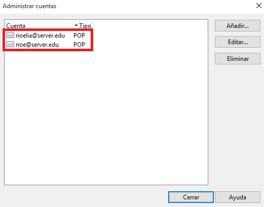

    Enviamos varios correos desde / hacia las diferentes cuentas y comprobar envío (real o ficticio) y carpetas mailroot. Las carpetas existentes en mailroot alojan mensajes en cola (Queue) y mensajes entregados (Drop).

    

    

    

    

    

    

    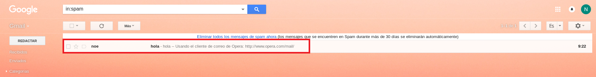

    

    

    

    

  * En el Servidor.

    Tenemos que añadir una nueva configuración de Servicio SMTP a través del administrador de aplicaciones (IIS) 6.0.

    Lo que tenemos que hacer es ir a Administrador del Servidor.

    

    Luego tenemos que ir a Herramientas y vamos a Administrador de Internet Information Services (IIS) 6.0.

    

    

    Realizamos la configuración en las propiedades de SMTP.

    

    

    Establecemos la autenticación básica de Windows.

    

    

    Probamos diferentes configuraciones de dominio predeterminado, por ejemplo, cifrado TLS.

    

    

  * En el Cliente Windows.

    Configuramos las cuentas según los parámetros especificados en el Servidor.

    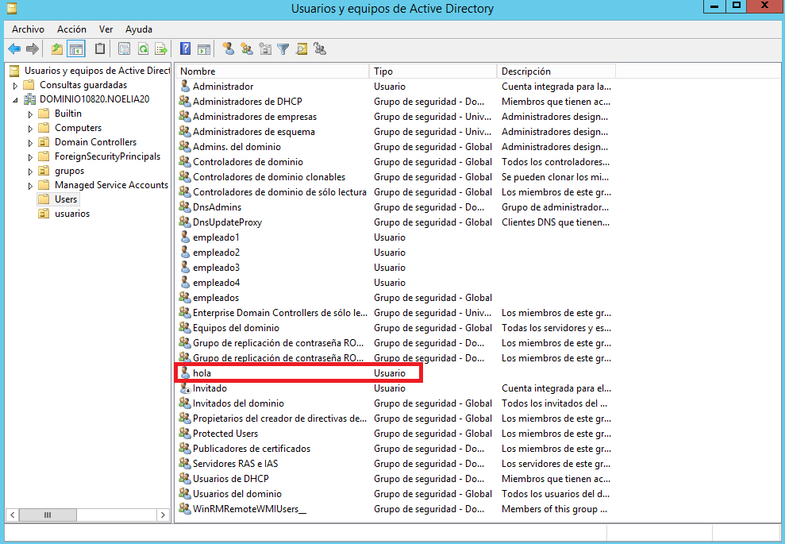

    

    

    

    

    

    

    

    

    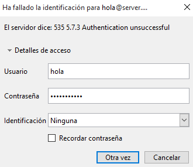

    

    

    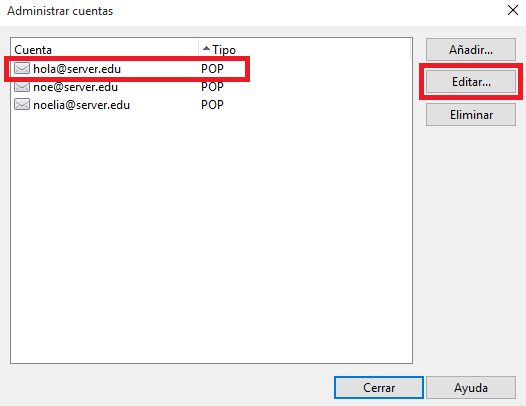

    

    

    

    Enviamos varios correos desde / hacia las diferentes cuentas y comprobamos el envío y las carpetas mailroot. En este caso sólo tendrán acceso al servidor SMTP cuentas del dominio y correspondientes a usuarios de AD.

    

    

    

    

    

    

    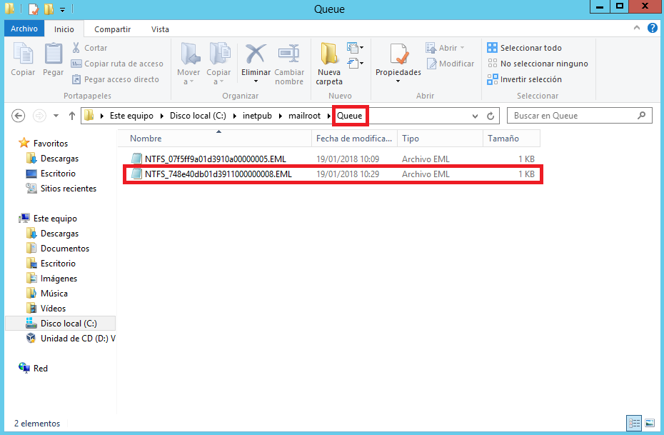

    

---

# **Práctica hMailServer Windows 2012 Server.**

---

## **Configuración De hMailServer En Windows Server 2012.**

---

Queremos configurar un Servidor de Correo para nuestra red local, para que los usuarios de nuestra red puedan comunicarse por correo electrónico.

En primer lugar, hay que desinstalar el Servicio SMTP de Windows 2012 Server.

Lo primero que tenemos que hacer es ir a Administrador del Servidor.

Luego tenemos que ir a Administrar y vamos a Quitar roles y funciones.

El resto de pasos los realizamos como se pueden ver en las imágenes.

Finalmente terminamos la desinstalación del Servicio SMTP en Windows 2012 Server.

Ahora tenemos que instalar las Características de .NET Framework 3.5.

Lo que tenemos que hacer es ir a Administrador del Servidor.

Luego tenemos que ir a Administrar y vamos a Agregar roles y características.

El resto de pasos los realizamos como se pueden ver en las imágenes.

Finalmente terminamos la instalación de las Características de .Net Framework 3.5.

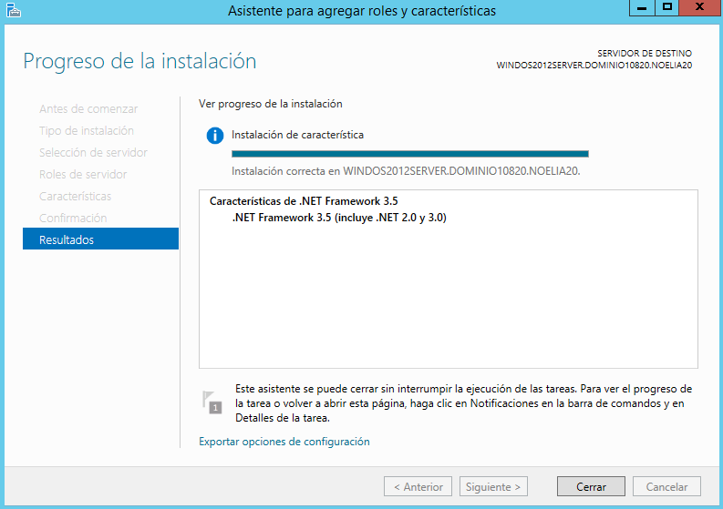

Debemos descargar e instalar en el Servidor Windows 2012 Server el Servidor de Correo hMailServer.

Vamos a la página oficial de [hMailServer](https://www.hmailserver.com/).

Vamos a la pestaña Download y nos descargamos hMailServer.

El resto de pasos de la instalación los realizamos como se pueden ver en las imágenes.

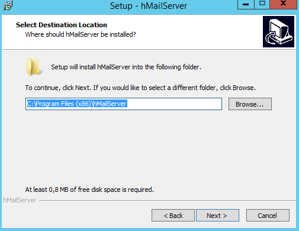

Finalmente terminamos la instalación de hMailServer.

Entramos en hMailServer.

Ponemos la contraseña que pusimos durante la instalación de hMailServer.

Creamos dos dominios denominados `srd.edu` y `asir.edu`.

Para añadir los dos nuevos dominios solo tenemos que pinchar en Añadir dominio.

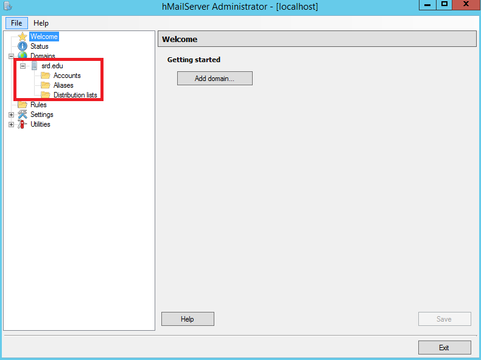

Ejecutamos los diagnósticos para ambos dominios.

* `asir.edu`.

* `srd.edu`.

Solucionamos el error de backup asignando una carpeta para tal fin. Para ello creamos la carpeta `C:\backup`. También establecemos una copia de seguridad de los mensajes.

Ejecutamos los diagnósticos para ambos dominios denuevo.

* `asir.edu`.

* `srd.edu`.

Creamos dos cuentas para dos usuarios ficticios en cada uno de los dos dominios. Configuramos las cuentas con diferentes opciones, como por ejemplo, auto-reply y forwarding.

* `asir.edu`.

* `srd.edu`.

Configuramos el Servicio DNS para crear las entradas `mail.srd.edu` y `mail.asir.edu` que apunten a la dirección IP del Servidor Windows 2012, es decir, 172.18.20.11.

Lo primero que tenemos que hacer es ir a Administrador del Servidor.

Luego a DNS para poder crear dos nuevas zonas de búsqueda directa en el Servidor.

Creamos una zona de búsqueda directa.

Nos sale el asistente para la nueva zona.

Elegimos el tipo de zona que queremos.

Seleccionamos que queremos que se repliquen los datos para todos los servidores DNS que se ejecutan en controladores de dominio en el dominio que tengo.

Le ponemos un nombre a nuestra zona.

Permitimos actualizaciones dinámicas seguras.

Se ha creado la nueva zona.

Ya contamos con otra zona de búsqueda directa.

En la zona de búsqueda directa añadimos un host nuevo (A).

Un host para el Servidor denominado mail.

Ya tenemos este registro creado.

En la zona de búsqueda directa añadimos un nuevo intercambio de correo (MX).

Este nuevo registro estará apuntado al registro creado anteriormente.

Ya tenemos este registro creado.

Creamos una zona de búsqueda directa.

Nos sale el asistente para la nueva zona.

Elegimos el tipo de zona que queremos.

Seleccionamos que queremos que se repliquen los datos para todos los servidores DNS que se ejecutan en controladores de dominio en el dominio que tengo.

Le ponemos un nombre a nuestra zona.

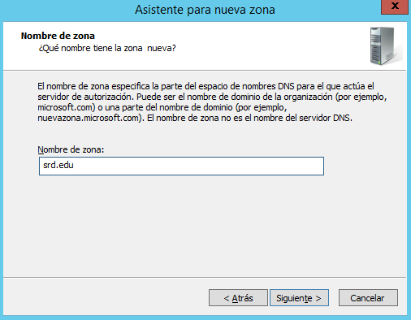

Permitimos actualizaciones dinámicas seguras.

Se ha creado la nueva zona.

Ya contamos con otra zona de búsqueda directa.

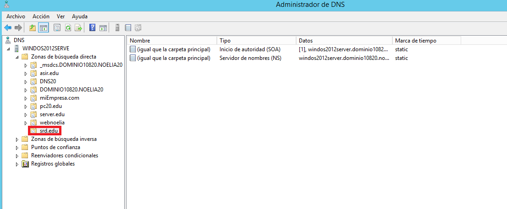

En la zona de búsqueda directa añadimos un host nuevo (A).

Un host para el Servidor denominado mail.

Ya tenemos este registro creado.

En la zona de búsqueda directa añadimos un nuevo intercambio de correo (MX).

Este nuevo registro estará apuntado al registro creado anteriormente.

Ya tenemos este registro creado.

Ejecutamos los diagnósticos para ambos dominios.

* `asir.edu`.

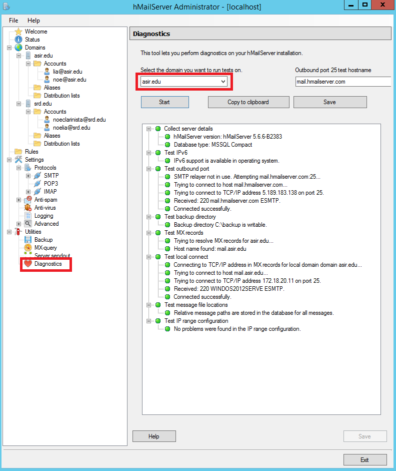

* `srd.edu`.

Realizamos todas las opciones de configuración que consideremos necesarias y convenientes, como por ejemplo, opciones de protocolos SMTP, bloqueo de correo entrante y logging.

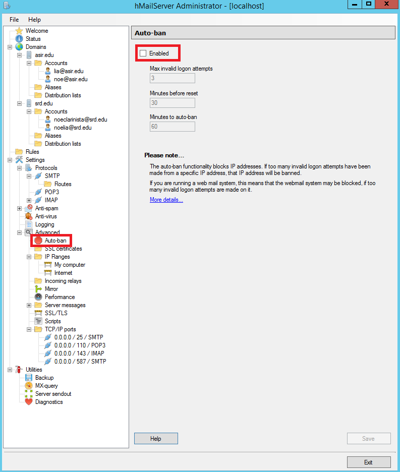

Configuramos en el Cliente W10 dos Clientes de correo como Live Mail para acceder al Servidor de correo instalado en Windows 2012.

Realizamos pruebas de envío y recepción de correos entre los diferentes usuarios, comprobando, además de envío y recepción correctas, el efecto de las opciones configuradas en las cuentas.

Creamos una lista de distribución asociada al dominio y añadimos a los dos usuarios de `asir.edu` a ella.

Realizamos pruebas de envío y recepción de correos por medio de la lista de distribución.

---
