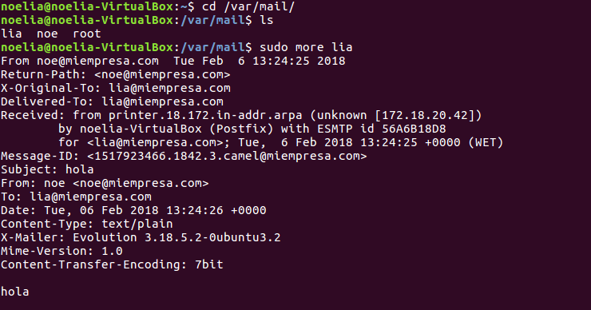
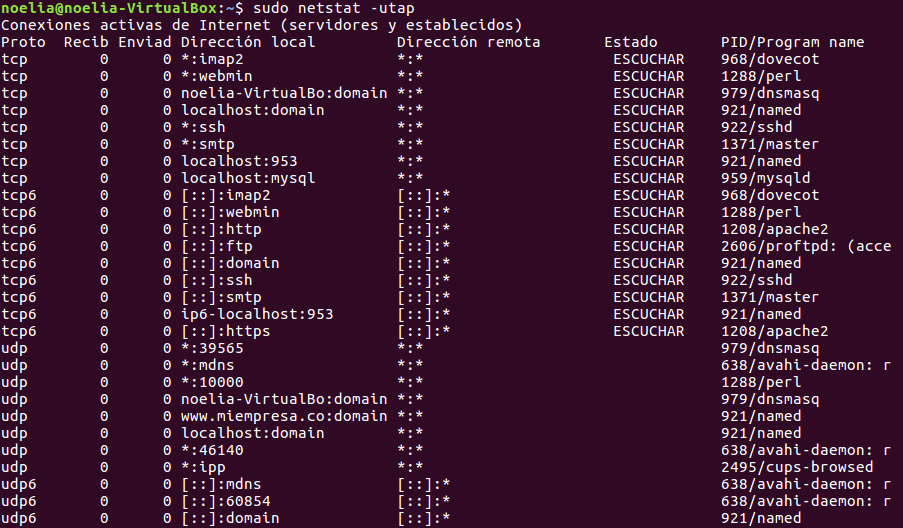

___

>Trabajo Realizado Por:
>
>* Noelia Hernández Domínguez.
>
>* Omar Hernández Padrón.

---

# **Instalación Y Configuración De Un Servidor De Correo En Linux.**

---

Instalamos el Servicio SMTP en Linux, utilizando el Servidor Postfix.

  Descargamos e instalamos Postfix con el comando apt-get install postfix.

  

  Utilizamos la siguiente configuración de Postfix.

  Escogemos la instalación como Sitio de Internet.

  

  Creamos el dominio `miempresa.com`.

  

  Comprobamos el Servicio (y puerto) SMTP activo y a la escucha con el comando netstat –utap.

  

  Realizamos una prueba de envío de mensaje entre dos usuarios del sistema mediante Telnet.

  

  

  Instalamos un Cliente de correo electrónico en un Cliente, por ejemplo, Evolution, para Ubuntu.

  

  Creamos dos nuevas entradas en `/etc/hosts`, por ejemplo, `smtp.miempresa.com` y `pop.miempresa.com` asociadas a la IP del Servidor, es decir, asociada a 172.18.20.41.

  

  

  Creamos dos cuentas asociadas a usuarios existentes en el Servidor y asociadas al dominio creado en Postfix.

  * Cuentas en el Servidor.

  

  * Cuentas en el Cliente.

  

  Configuramos los datos de las cuentas (dirección correo, servidores entrante y saliente).

  

  

  

  

  

  

  

  

  

  

  

  

  

  

  

  

  

  

  

  Realizamos el envío de dos correos, uno con cada una de las cuentas creadas.

  

  

  

  

  Comprobamos la recepción de estos correos en el Servidor examinando la carpeta `/var/mail`.

  

  

Instalamos el Servicio IMAP y Servidor Correo Web SquirrelMail.

  Instalamos el Servicio IMAP con el comando apt-get install dovecot-imapd.

  

  Comprobamos el Servicio (y puerto) IMAP activo y a la escucha con el comando netstat –utap.

  

  Instalamos la aplicación correo web SquirrelMail con el comando apt-get install squirrelmail.

  

  La carpeta de configuración la podemos ver en `/etc/squirrelmail`.

  

  La carpeta de aplicación la podemos ver en `/usr/share/squirrelmail`.

  

  Copiamos las líneas no comentadas del fichero `/etc/squirrelmail/apache.conf` en un nuevo fichero .conf de `/etc/apache2/sites-available`.

  

  

  

  Habilitamos el sitio.

  

  Reiniciamos Apache.

  

  Accedemos vía HTTP en `/localhost/squirrelmail`.

  

  

  

  

  Accedemos desde una máquina Cliente, vía HTTP, al gestor de correo SquirrelMail instalado.

  

  

  

  Enviamos y recibimos correos entre las dos cuentas creadas desde el Cliente utilizando el gestor de correo web SquirrelMail.

  

  

  

  

  

  

  

  

  

  

  

  Comprobamos que los mensajes enviados desde ambas cuentas se siguen encontrando en los respectivos buzones de los usuarios en `/var/mail`.

  

  

Instalamos el Servicio POP3.

  Instalamos el Servicio POP3 con el comando apt-get install dovecot-pop3d.

  

  Comprobamos el Servicio (y puerto) POP3 activo y a la escucha con el comando netstat –utap.

  

  Configuramos MUA (gestor de correo cliente Evolution) en la máquina Cliente para que acceda a la recepción de correo a través del protocolo POP3 instalado en el Servidor.

  Borramos los usuarios creados.

  

  Creamos denuevo los usuarios pero esta vez con el Servicio POP3.

  

  

  

  

  

  

  

  

  

  

  

  

  

  

  

  

  

  Vamos al Servidor. Vamos a la configuración de Dovecot y descomentamos una línea en el fichero `10-auth.conf`.

  

  

  Reiniciamos el Servicio de Dovecot.

  

  Enviamos y recibimos correos entre las dos cuentas creadas desde el Cliente y utilizando el gestor de correo del Cliente.

  

  

  

  

  Comprobamos que los correos enviados y recibidos no han desaparecido de los buzones respectivos de los usuarios en `/var/mail`.

  

  

---
