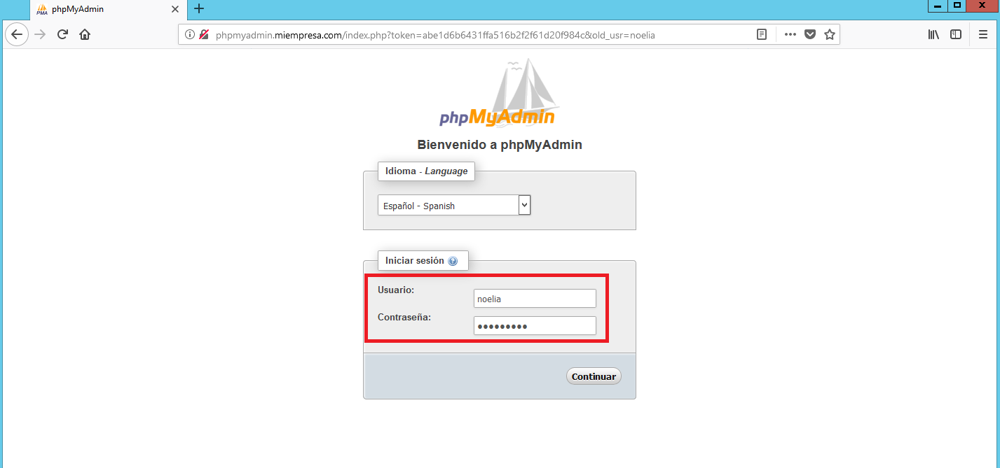
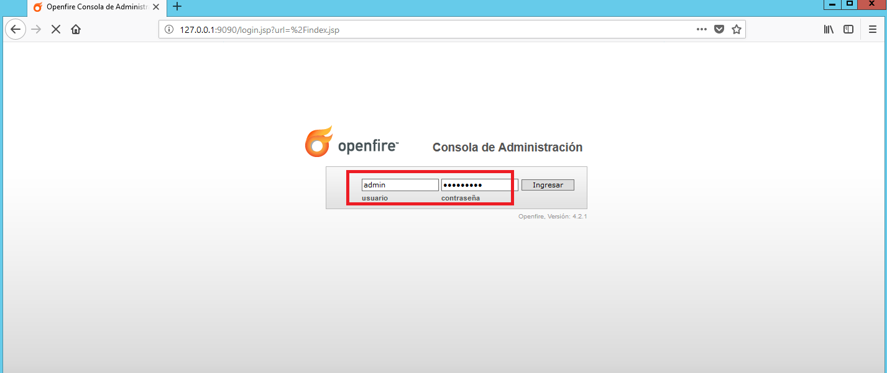

___

# **Instalación Y Configuración De Un Servidor De Mensajería Instantánea En Windows.**

---

Comprobamos que en el Servidor Windows 2012 están instalados y funcionan correctamente el IIS, el PHP, el MySQL y el phpMyAdmin.

Descargamos e instalamos el Servidor de mensajería instantánea OpenFire para Windows.

Los pasos de la instalación los realizamos como se pueden ver en las siguientes imágenes.

Iniciamos (Start) el Servidor de mensajería Openfire.

Creamos una base de datos en blanco en MySqQL a través de phpMyAdmin y recordamos el nombre de la BD, así como el usuario y la contraseña con privilegios.

Ejecutamos el script de instalación de Openfire desde un navegador web del Servidor, mediante la URL `http://127.0.0.1:9090`.

Seleccionamos las siguientes opciones de instalación y configuración de Openfire.

En la pantalla de “Configuración de Perfil” seleccionamos la opción “Por Defecto”.

Seleccionamos las siguientes opciones de instalación y configuración de Openfire.

Una vez completada la instalación, accedemos a la consola de administración de Openfire con el usuario administrador creado. Comprobamos este acceso tanto desde el Servidor como desde una máquina Cliente.

* Desde el Servidor.

  

  

* Desde el Cliente.

  

  

Una vez instalado el Servidor OpenFire, vamos a descargarnos e instalar un Cliente de Mensajería.

  Descargamos el Cliente de mensajería Spark.

  

  Instalamos Spark en nuestro Servidor Windows Server.

  Los pasos de la instalación los realizamos como se pueden ver en las siguientes imágenes.

  

  

  

  

  

  

  Instalamos también Spark en nuestro Cliente Windows 10.

  Los pasos de la instalación los realizamos como se pueden ver en las siguientes imágenes.

  

  

  

  

  

  

Ahora vamos a crear dos nuevos usuarios en OpenFire (además del Administrador) para poder mantener una conversación entre Cliente y Servidor.

* Usuario `noe`.

* Usuario `lia`.

Ejecutamos Spark tanto en el Cliente como en el Servidor, validamos en cada uno de ellos con un usuario diferente de los que hemos creado.

* En el Servidor, con el usuario `noe`.

* En el Cliente, con el usuario `lia`.

Lo primero que tenemos que hacer es invitar usuarios, lo realizamos desde el usuario `noe`.

Para ello vamos a Contactos, Agregar contacto.

Agregamos a nuestros contactos el usuario `lia`.

En el usuario `lia` aceptamos que nos agreguen a su lista de contactos.

En el usuario `noe` aceptamos que nos agreguen a su lista de contactos.

Ya tenemos a los dos usuarios agregados entre ellos.

* Usuario `noe`.

* Usuario `lia`.

Creamos un cuarto de conferencia e iniciamos conferencias, para ello lo creará el usuario `noe`.

Creamos un cuarto de conferencia.

Ya estaría el usuario `noe` dentro del cuarto de conferencia.

Añadimos el usuario `lia` al cuarto de conferencia.

Ya estaría el usuario `lia` dentro del cuarto de conferencia.

* Usuario `lia`.

* Usuario `noe`.

Iniciamos conversaciones entre ambas máquinas usando los Clientes de mensajería.

* Usuario `noe`.

* Usuario `lia`.

Transferimos archivos entre ambas máquinas usando los Clientes de mensajería.

* Usuario `lia`.

* Usuario `noe`.

* Usuario `lia`.

Realizamos una discusión desde Spark entre ambos Clientes de mensajería.

* Usuario `noe`.

* Usuario `lia`.

* Usuario `noe`.

Revisamos las opciones que tenemos desde OpenFire.

Creamos una sala de conferencia desde OpenFire.

* Usuario `lia`.

* Usuario `noe`.

* Usuario `lia`.

Instalamos y probamos SparkWeb de OpenFire.

Vamos a IIS para crear un nuevo sitio web denominado sparkweb asociado a la carpeta sparkweb y con acceso a través de la dirección sparkweb.miempresa.com.

Añadimos a Documento predeterminado a `SparWeb.html`.

Actualizamos el DNS adecuadamente.

Finalmente entramos en un navegador web mediante la URL `http://sparkweb.miempresa.com` y veríamos lo siguiente.

---
