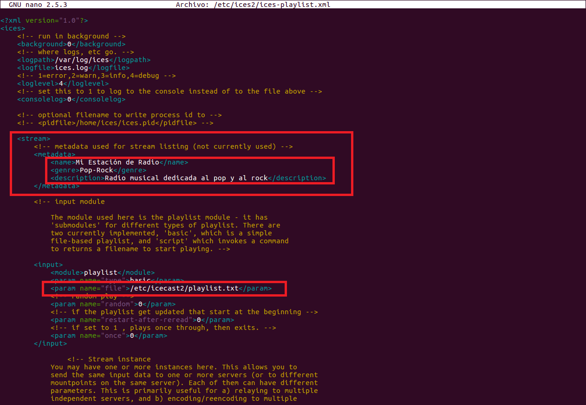
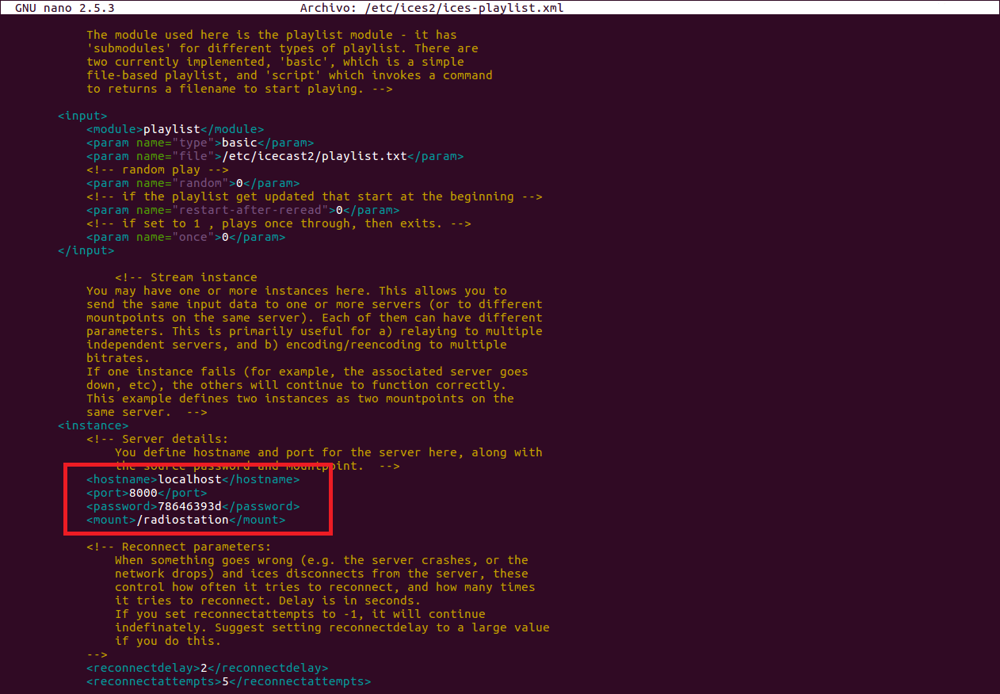
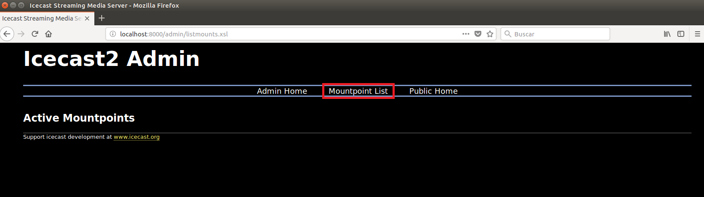

___

# **Instalación Y Configuración De Un Servidor Multimedia (Audio) En Linux.**

---

Vamos a instalar un Servicio de Audio orientado a una emisión de radio musical.

Descargamos e instalamos el paquete IceCast (Servidor de Audio) con el comando apt-get install icecast2.

Mientras hacemos la instalación nos pedirá si queremos configurar Icecast2.

Editamos el fichero `/etc/icecast/icecast2.xml` y modificamos las siguientes líneas.

Editamos el fichero `/etc/default/icecast2` y modificamos la siguiente línea.

Iniciamos el Servicio correspondiente a Icecast con el comando `/etc/init.d/icecast2` start.

Instalamos el codificador vorbis ices2 con el comando apt-get install ices2.

Creamos el directorio para el codificador y copiamos el fichero de configuración por defecto.

Editamos el fichero de configuración del codificador y establecemos los parámetros de nuestra emisora mediante las siguientes etiquetas.

Recopilamos unos cuantos ficheros de audio en formato ogg y los copiamos en el directorio `/tmp/música`.

Creamos el fichero `playlist.txt` y le damos permisos.

Generamos la lista de reproducción con el comando find `/tmp/música` –iname `“*.ogg”` > `/etc/icecast2/playlist.txt`.

Creamos el directorio log de ices2.

Reiniciamos el Servicio de Icecast2.

Procedemos a acceder al entorno web de información y administración de nuestro Servidor de audio Icecast, a través del `localhost` del Servidor y el puerto configurado anteriormente (8000).

Accedemos con el nombre de usuario y contraseña que establecimos en la configuración.

Comprobamos estado del Servicio, configuración y propiedades.

Accedemos vía web a la lista del punto de montaje desde el propio Servidor.

Ejecutamos el codificador en background con el comando ices2 `/etc/ices2/ices-playlist.xml` &.

Comprobamos el punto de montaje asociado a la lista de reproducción creada y propiedades.

Accedemos desde un posible Cliente Linux, a través de un navegador, a la reproducción de la lista.

---
