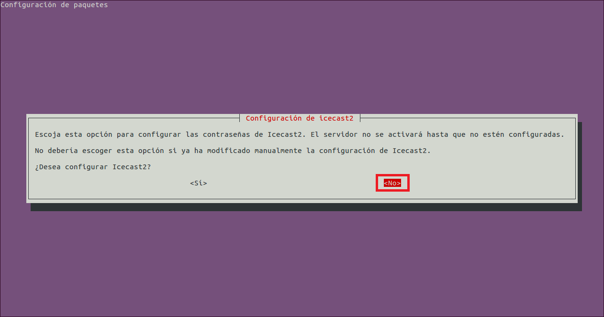
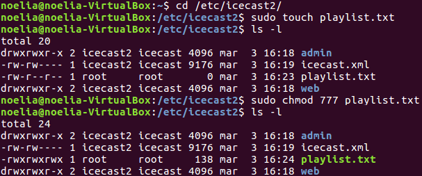

___

# **Instalación Y Configuración De Un Servidor Multimedia (Audio) En Linux.**

---

Vamos a instalar un Servicio de audio orientado a una emisión de radio musical.

Descargamos e instalamos el paquete IceCast (Servidor de Audio) con el comando apt-get install icecast2.

Editamos el fichero `/etc/icecast/icecast2.xml` y modificamos las siguientes líneas.

~~~
<source-password>contraseña_source</source-password>
<admin-user>tu_usuario</admin-user>
<admin-password>contraseña_administrador</admin-password>
~~~

Editamos el fichero `/etc/default/icecast` y modificamos la siguiente línea.

~~~
ENABLE=true
~~~

Iniciamos el Servicio correspondiente a Icecast con el comando `/etc/init.d/icecast2` start.

Instalamos el codificador vorbis ices2 con el comando apt-get install ices2.

Creamos el directorio para el codificador y copiamos el fichero de configuración por defecto.

~~~
$ mkdir /etc/ices2
$ cp /usr/share/doc/ices2/examples/ices-playlist.xml /etc/ices2
~~~

Editamos el fichero de configuración del codificador y establecemos los parámetros de nuestra emisora mediante las siguientes etiquetas.

> /etc/ices2/ices-playlist.xml
~~~
<name>Mi Estación de Radio</name>
<genre>Pop-Rock</genre>
<description>Radio musical dedicada al pop y al rock</description>
…
<param name=”file”>/etc/icecast2/playlist.txt</param>
…
<port>8000</port>
<password>tu_contraseña</password>
<mount>radiostation</mount>
~~~

Recopilar unos cuantos ficheros de audio en formato ogg y copiarlos en el directorio `/tmp/música`.

Generamos la lista de reproducción con el comando find `/tmp/música` –iname `“*.ogg”` > `/etc/icecast2/playlist.txt`.

Creamos el directorio log de ices2.

~~~
$ mkdir /var/log/ices2
~~~

Ejecutamos el codificador en background con el comando $ ices2 `/etc/ices2/ices-playlist.xml` &.

Procedemos a acceder al entorno web de información y administración de nuestro Servidor de audio Icecast, a través de la IP (o nombre DNS) del servidor y el puerto configurado anteriormente (8000). Accedemos con el nombre de usuario y contraseña que establecimos en la configuración.

Comprobamos estado del servicio, configuración y propiedades. Comprobar asimismo punto de montaje (Mountpoint) asociado a la lista de reproducción creada y propiedades.

Accedemos vía web a la lista de reproducción (mountpoint) desde el propio Servidor (IPServidor:puerto/mountpoint).

Accedemos desde un posible Cliente (Linux o Windows), a través de un navegador, tanto al entorno de administración como a la reproducción de la lista.

Tratamos de realizar una reproducción del Streaming de audio creado utilizando un software reproductor multimedia desde el Cliente (URL-> IP:puerto/mountpoint).

Investigamos en grupos el uso de uno de los siguientes paquetes de streaming de video para Linux.
* Darwin Streaming Server
* MediaTomb
* uShare
* GMediaServer

---
