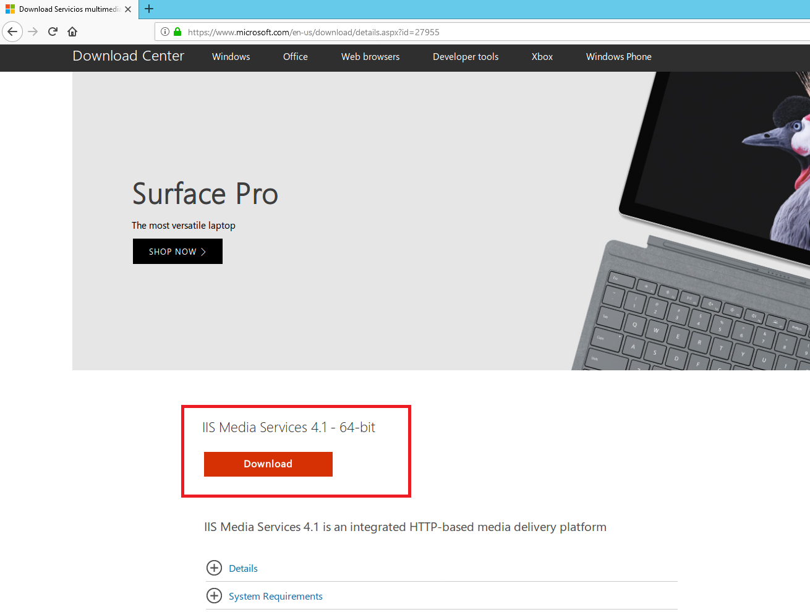
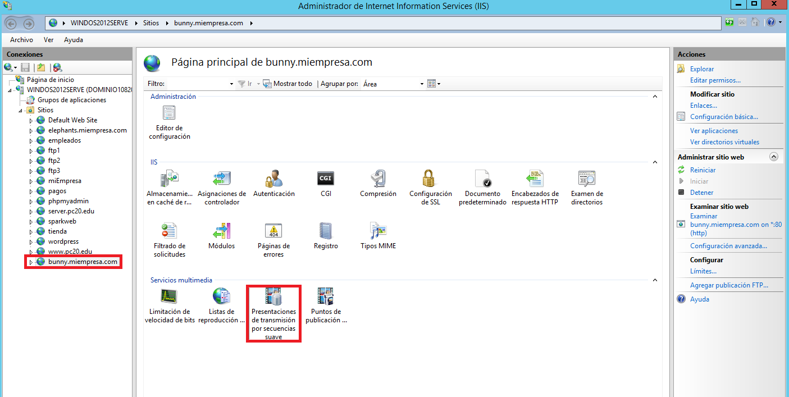

___

>Trabajo Realizado Por:
>
>* Noelia Hernández Domínguez.
>
>* Omar Hernández Padrón.

---

# **Instalación Y Configuración De Un Servidor Multimedia - Smooth Streaming En Windows 2012 Server.**

---

Descargamos e instalamos el IIS Media Services, soporte de Streaming para el Servidor Web IIS.

Los pasos de la instalación los realizamos como se pueden ver en las siguientes imágenes.

Vamos a Administrador del Servidor.

Ahora debemos ir Administrador de Internet Information Services (IIS).

Comprobamos que aparecen, tanto a nivel de Servidor como en los sitios web, las nuevas opciones de Servicios Multimedia.

Descargamos ejemplos de emisiones multimedia codificadas para su emisión en Streaming Windows Media Samples.

Descomprimimos sus contenidos en dos carpetas independientes que nos servirán para su publicación en Streaming.

Vamos a Administrador del Servidor.

Ahora debemos ir Administrador de Internet Information Services (IIS).

Creamos dos nuevos sitios web asociados a los contenidos multimedia descargados: `bunny.miempresa.com` y `elephants.miempresa.com`. Los sitios web deben ofrecerse a través de los enlaces descritos y apuntar a las carpetas físicas donde alojamos los contenidos multimedia respectivos.

* `elephants.miempresa.com`.

* `bunny.miempresa.com`.

Vamos a Administrador del Servidor.

Ahora debemos ir a DNS.

Creamos los registros DNS asociados a los sitios web `bunny.miempresa.com` y `elephants.miempresa.com`.

* `bunny.miempresa.com`.

* `elephants.miempresa.com`.

Descargamos y descomprimimos el Cliente de reproducción SmoothMediaPlayer. Copiamos los ficheros extraídos en las carpetas de los sitios web – Streaming.

* `bunny.miempresa.com`.

* `elephants.miempresa.com`.

Editamos el fichero `SmoothStreamingPlayer.html` para adaptarlo a la emisión en Streaming de los contenidos de cada sitio web.

* `elephants.miempresa.com`.

* `bunny.miempresa.com`.

Configuramos ambos sitios web para que accedan de forma predeterminada al archivo html anterior.

* `bunny.miempresa.com`.

* `elephants.miempresa.com`.

Antes de comprobar desde un navegador la reproducción tenemos que instalar Silverlight.

Los pasos de la instalación los realizamos como se pueden ver en las siguientes imágenes.

Comprobamos desde un navegador en el Servidor la reproducción de ambos sitios.

* `elephants.miempresa.com`.

* `bunny.miempresa.com`.

Antes de comprobar desde un navegador la reproducción tenemos que instalar Silverlight.

Los pasos de la instalación los realizamos como se pueden ver en las siguientes imágenes.

Comprobamos desde un navegador en una máquina Cliente la reproducción de ambos sitios.

* `bunny.miempresa.com`.

* `elephants.miempresa.com`.

En las características de los Servicios Multimedia de uno de los sitios, examinamos la Limitación de Velocidad de Bits.

Examinamos también la característica de Presentaciones de Transmisión por Secuencia Suave (Smooth Streaming) para comprobar el punto de acceso a la presentación y sus contenidos (pistas de audio / video).

---

# **Instalación Y Configuración De Un Servidor Multimedia - Codificación De Contenidos Propios En Windows 2012 Server.**

---

Descargamos e instalamos Microsoft Expression Encoder.

Los pasos de la instalación los realizamos como se pueden ver en las siguientes imágenes.

Para su correcta ejecución debemos instalar la Característica de Experiencia de Escritorio en mi Servidor Windows 2012.

Lo primero que tenemos que hacer es ir a Administrador del Servidor.

Luego tenemos que ir a Administrar y vamos a Agregar roles y características.

El resto de pasos los realizamos como se pueden ver en las imágenes.

Finalmente terminamos la instalación de la Característica de Experiencia de Escritorio en mi Servidor Windows 2012.

Reiniciamos la máquina virtual para completar la instalación de la característica anteriormente instalada.

Vamos a crear un nuevo sitio web en IIS para la emisión de una presentación multimedia en Streaming pero, en este caso, se van a utilizar contenidos propios. Así que, en primer lugar debemos contar con una serie de archivos de audio y/o video (formatos mp3, wma, avi).

A continuación creamos el sitios IIS (lo podemos llamar Playlist) que estaría asociado a un registro DNS (playlist.tudominio.ext) y a una carpeta física (por ahora vacía) en cualquier lugar de nuestro disco duro.

* Carpeta física.

* Sitios IIS.

* DNS.

En este momento, vamos a realizar la codificación de los archivos multimedia que hemos elegido para que puedan emitirse en streaming. Para ello utilizaremos la aplicación Mircosoft Expression Encoder.

Al Ejecutar el codificador (Encoder) seleccionaremos la opción Proyecto de Silverlight. Luego añadiremos los archivos que nos interesen y procederemos a codificarlos. Antes ajustaremos el directorio de salida de la codificación a la carpeta donde alojamos el sitio web Playlist.

Ahora estableceremos como archivo predeterminado la página html que se ha creado en la carpeta Playlist como punto de acceso a la presentación en streaming y reiniciaremos el sitio web.

Sólo nos queda comprobar en el servidor y en un cliente la correcta reproducción de nuestro Playlist.

---
