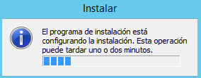

___

>Trabajo Realizado Por:
>
>* Noelia Hernández Domínguez.
>
>* Omar Hernández Padrón.

___

# **Instalación Y Configuración Del Servicio VoIP En Windows 2012 Server.**

---

Instalamos y configuramos un Servidor y un Cliente para establecer comunicaciones de voz mediante el Servicio VoIP (Voice Over Internet Protocol) sobre sistemas Windows.

En el Servidor nos registramos, descargamos e instalamos el software para central PBX 3CX Phone System.

Para la instalación del servidor PBX se necesita .NET Framework 4.6.1.

Reiniciamos la máquina virtual para poder completar la instalación de .NET Framework.

>Seguimos los pasos seleccionando la opción de Servidor que consideres adecuada e IIS como servidor web asociado al panel de control de 3CX.

Iniciamos el panel de control, para ello elegimos la opción 1, y realizamos las siguientes acciones de configuración.

o Seleccionar extensiones de 3 dígitos y configuración regional adecuada.
o Configurar los datos del usuario operador.
o Seleccionar países con los que se podrá establecer comunicación.
o Comprobar funcionamiento correcto entrada DNS.
o Crear,   al   menos, tres    extensiones   correspondientes   a   diferentes  usuarios con toda su información.

* Nos descargamos e instalamos el SIP softphone 3CX Phone.

* Cliente PC (W10):  Descargar  e  instalar  el  software  SIP  softphone  3CX   Phone  for Windows.

* Servidor  y  Clientes:  Realizar  la  instalación  y  configuración  completa  del  3CX Phone   siguiendo  las  los  enlaces  y  manuales  tanto  en  el  servidor  como  en   los clientes  con  el  fin  de  establecer  una  comunicación  interna  de  voz  entre  los  
usuarios.  Crear las cuentas correspondientes a los usuarios en cada terminal.

Efectuamos llamadas entre los usuarios correspondientes a las extensiones creadas en el Servidor.

* Extensión 001 llama a extensión 002.

* Extensión 002 llama a extensión 001.

---
