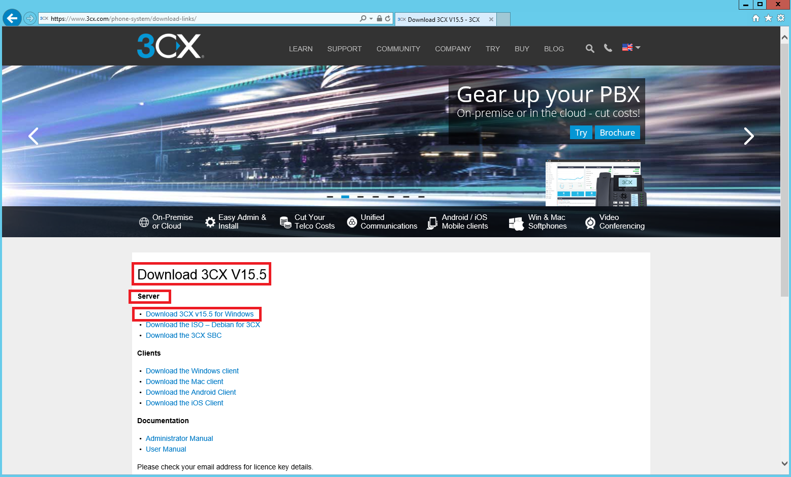

___

>Trabajo Realizado Por:
>
>* Noelia Hernández Domínguez.
>
>* Omar Hernández Padrón.

___

# **Instalación Y Configuración Del Servicio VoIP En Windows 2012 Server.**

---

Instalamos y configuramos un Servidor y un Cliente para establecer comunicaciones de Voz mediante el Servicio VoIP (Voice Over Internet Protocol) sobre sistemas Windows.

En el Servidor nos registramos, descargamos e instalamos el software para central PBX 3CX Phone System.

Vamos a la página oficial de [3xc](http://www.3cx.es)

Nos registramos.

Descargamos PBX 3CX Phone System.

Empezamos la instalación del PBX 3CX Phone System.

Para la instalación del Servidor PBX se necesita .NET Framework 4.6.1.

Los pasos de la instalación los realizamos como se pueden ver en las siguientes imágenes.

Reiniciamos la máquina virtual para poder completar la instalación de .NET Framework.

Los pasos de la instalación los realizamos como se pueden ver en las siguientes imágenes.

Para la instalación del servidor PBX se necesitan Microsoft Visual C++ 2008 Redistributable, Microsoft Visual C++ 2010 Redistributable x64 y Microsoft Visual C++ 2015 Redistributable (x64).

Los pasos de la instalación los realizamos como se pueden ver en las siguientes imágenes.

Finalmente ya se nos instalará el PBX 3CX Phone System.

Iniciamos el panel de control, para ello elegimos la opción 1, y realizamos las siguientes acciones de configuración.

Ponemos la clave de la licencia que se nos mando por correo después de registrarnos.

Añadimos un usuario y su contraseña.

Añadimos una clave pública.

Decimos que la IP pública es estática.

Seleccionamos nuestro subdominio.

Seleccionamos los puertos para poder acceder a nuestro panel de control.

Añadimos una IP local.

Esperamos que carguen los datos.

Seleccionamos extensiones de 3 dígitos.

Añadimos el correo electrónico del administrador.

Seleccionamos la configuración regional adecuada.

Creamos una extensión, del usuario operador.

Seleccionamos los países con los que se podrá establecer comunicaciones.

Seleccionamos el idioma.

Confirmamos los datos de registro.

Esperamos que se cree todo en la base de datos.

Finalmente ya tenemos creado el panel de control del 3CX.

Entramos a nuestro panel de control poniendo nuestras credenciales.

Vemos todo los datos en nuestro panel de control.

Creamos tres extensiones correspondientes a diferentes usuarios con toda su información.

* lia.

* noe.

* noeclarinista.

Ya tenemos las tres extensiones creadas.

Nos descargamos e instalamos el SIP softphone 3CX Phone.

Los pasos de la instalación los realizamos como se pueden ver en las siguientes imágenes.

En el Cliente Windows 10 descargamos e instalamos el software SIP softphone 3CX Phone for Windows.

Los pasos de la instalación los realizamos como se pueden ver en las siguientes imágenes.

* Servidor  y  Clientes:  Realizar  la  instalación  y  configuración  completa  del  3CX Phone   siguiendo  las  los  enlaces  y  manuales  tanto  en  el  servidor  como  en   los clientes  con  el  fin  de  establecer  una  comunicación  interna  de  voz  entre  los  
usuarios.  Crear las cuentas correspondientes a los usuarios en cada terminal.

Efectuamos llamadas entre los usuarios correspondientes a las extensiones creadas en el Servidor.

* Extensión 001 llama a extensión 002.

* Extensión 002 llama a extensión 001.

---
